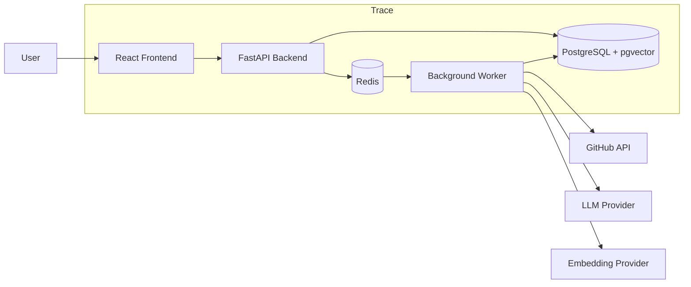
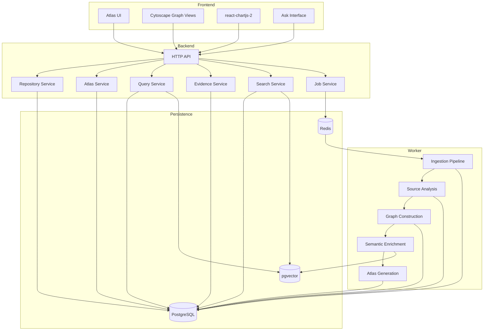
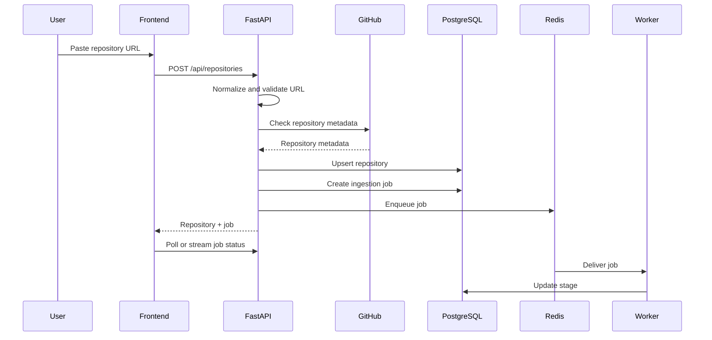
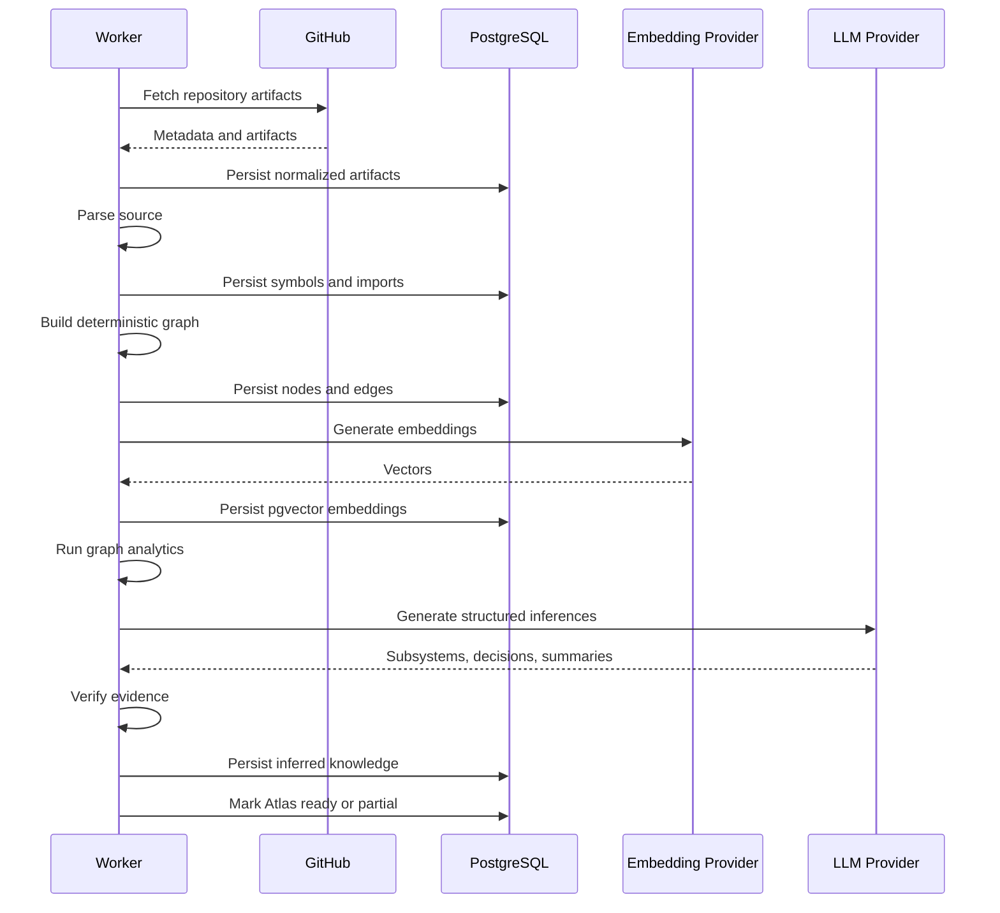
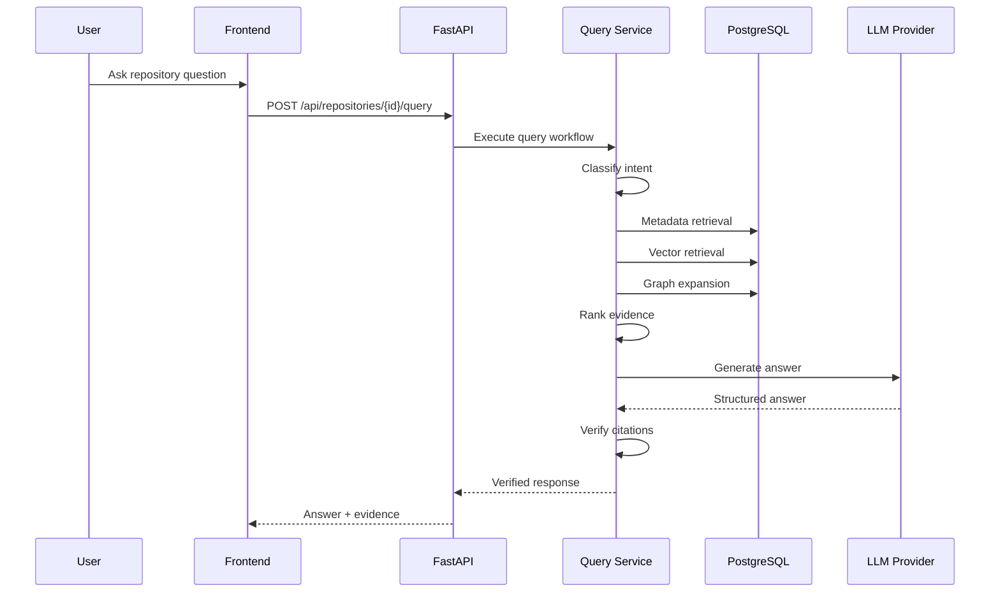
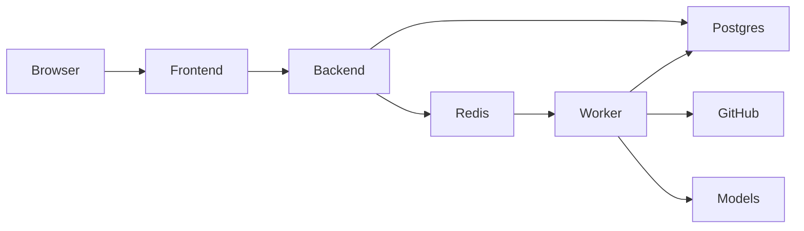

# Trace — System Architecture

> Technical architecture for the Trace Software Intelligence platform.

This document defines how Trace is structured and how its components collaborate.

Related documents:

- [`overview.md`](overview.md) — product vision
- [`product.md`](product.md) — functional requirements
- [`ontology.md`](ontology.md) — repository entities and relationships
- [`ai-system.md`](ai-system.md) — extraction, retrieval, reasoning, and verification
- [`database.md`](database.md) — persistence model
- [`api.md`](api.md) — HTTP contracts
- [`evaluation.md`](evaluation.md) — research and quality evaluation
- [`roadmap.md`](roadmap.md) — implementation sequence

---

## 1. Architecture Goals

Trace architecture must support four goals.

### 1.1 Reliable Repository Understanding

The system must extract deterministic facts before generating probabilistic interpretations.

### 1.2 Explainable AI

Every inferred output must retain:

- provenance
- confidence
- supporting evidence
- generator version
- creation timestamp

### 1.3 Resumable Long-Running Work

Repository ingestion may take minutes.

The system must support:

- asynchronous jobs
- stage-level progress
- retries
- idempotency
- partial completion
- failure recovery

### 1.4 Replaceable Infrastructure

Provider-specific logic must remain behind interfaces.

Replaceable components include:

- GitHub client
- embedding provider
- LLM provider
- graph persistence backend
- job queue backend
- parser implementation
- reranker

---

## 2. Architecture Principles

## 2.1 Modular Monolith First

MVP uses one backend codebase with clear internal module boundaries.

Reasons:

- faster development
- easier local debugging
- lower operational complexity
- simpler CI
- easier portfolio demonstration

Logical boundaries are preserved so components can later become separate services.

## 2.2 Async at System Boundaries

Use asynchronous I/O for:

- GitHub requests
- database access
- Redis interaction
- model-provider calls

CPU-heavy parsing and graph analysis may run in worker tasks.

## 2.3 Deterministic Before Probabilistic

Pipeline order:

```text
Fetch facts
    ↓
Normalize artifacts
    ↓
Build deterministic relationships
    ↓
Run graph algorithms
    ↓
Generate embeddings
    ↓
Run AI extraction
    ↓
Verify evidence
    ↓
Publish Atlas
```

## 2.4 Evidence Is a First-Class Data Model

Evidence is not appended as plain text after generation.

Every inferred entity or edge references structured evidence records.

## 2.5 Partial Availability Is Better Than Total Failure

If AI generation fails, deterministic Atlas sections should remain available.

Example:

```text
GitHub ingestion: complete
Structural graph: complete
Embeddings: complete
Subsystem labeling: failed
Decision extraction: failed
```

Expected state:

```text
Atlas status: partial
```

## 2.6 Progressive Complexity

MVP uses:

- PostgreSQL
- pgvector
- Redis
- one worker process
- one backend service
- one frontend service

Future scale may introduce:

- Neo4j
- distributed workers
- object storage
- separate retrieval service
- separate model gateway

---

## 3. System Context



External actors:

- user
- GitHub API
- LLM provider
- embedding provider

Internal systems:

- frontend
- backend API
- background worker
- PostgreSQL
- Redis

---

## 4. High-Level Component Model



---

## 5. Technology Stack

## 5.1 Frontend

- React
- TypeScript
- Vite
- React Router
- TanStack Query
- Tailwind CSS
- Cytoscape.js
- `react-chartjs-2`
- Zod for client contract validation where useful
- Vitest
- React Testing Library
- Playwright

## 5.2 Backend

- Python 3.13
- FastAPI
- Pydantic
- Pydantic Settings
- SQLAlchemy 2.x
- Alembic
- Psycopg
- httpx
- NetworkX
- LangGraph
- pytest
- Ruff
- mypy

## 5.3 Data and Infrastructure

- PostgreSQL
- pgvector
- Redis
- Docker
- Docker Compose
- GitHub Actions

## 5.4 Future-Compatible Components

- Neo4j graph repository
- hosted object storage
- distributed task queue
- dedicated model gateway
- OpenTelemetry collector
- managed PostgreSQL
- managed Redis

---

## 6. Repository Structure

Recommended repository layout:

```text
trace/
├── backend/
│   ├── src/
│   │   ├── api/
│   │   ├── core/
│   │   ├── db/
│   │   ├── domain/
│   │   ├── repositories/
│   │   ├── services/
│   │   ├── workers/
│   │   ├── integrations/
│   │   ├── ai/
│   │   ├── graph/
│   │   ├── parsers/
│   │   └── main.py
│   ├── tests/
│   ├── alembic/
│   ├── pyproject.toml
│   └── Dockerfile
├── frontend/
│   ├── src/
│   │   ├── app/
│   │   ├── components/
│   │   ├── features/
│   │   ├── pages/
│   │   ├── hooks/
│   │   ├── lib/
│   │   ├── types/
│   │   └── test/
│   ├── package.json
│   └── Dockerfile
├── docs/
│   ├── overview.md
│   ├── product.md
│   ├── architecture.md
│   ├── ontology.md
│   ├── ai-system.md
│   ├── database.md
│   ├── api.md
│   ├── evaluation.md
│   ├── ux.md
│   └── roadmap.md
├── eval/
├── compose.yaml
└── README.md
```

---

## 7. Backend Module Boundaries

## 7.1 `api`

Responsibilities:

- route definitions
- request validation
- response models
- authentication later
- HTTP status mapping

Must not contain:

- SQL queries
- graph algorithms
- LLM prompts
- GitHub pagination logic

## 7.2 `domain`

Contains core business models and enums.

Examples:

- Repository
- IngestionJob
- Node
- Edge
- Evidence
- AtlasSection
- Decision
- Subsystem
- ConfidenceBand

Domain models must remain independent of FastAPI.

## 7.3 `repositories`

Persistence interfaces and implementations.

Examples:

- RepositoryRepository
- JobRepository
- NodeRepository
- EdgeRepository
- EvidenceRepository
- EmbeddingRepository
- AtlasRepository
- GraphRepository

MVP implementation:

```text
PostgresGraphRepository
```

Future implementation:

```text
Neo4jGraphRepository
```

## 7.4 `services`

Business orchestration.

Examples:

- RepositoryService
- AtlasService
- QueryService
- SearchService
- EvidenceService
- ContributorService
- TimelineService

## 7.5 `integrations`

External provider adapters.

Examples:

- GitHubClient
- OpenAIProvider
- LocalEmbeddingProvider
- HostedEmbeddingProvider

## 7.6 `parsers`

Language-aware source extraction.

Examples:

- PythonParser
- TypeScriptParser
- JavaScriptParser
- GenericFileParser

## 7.7 `graph`

Graph construction and analytics.

Examples:

- GraphBuilder
- ImportGraphBuilder
- DependencyAnalyzer
- CommunityDetector
- CentralityCalculator

## 7.8 `ai`

AI-specific logic.

Examples:

- prompt templates
- structured output schemas
- retrieval planner
- graph retriever
- vector retriever
- evidence verifier
- LangGraph workflows

## 7.9 `workers`

Background-job entrypoints and stage orchestration.

---

## 8. Frontend Architecture

Frontend is organized by product feature.

```text
frontend/src/features/
├── repositories/
├── ingestion/
├── overview/
├── architecture/
├── subsystems/
├── timeline/
├── decisions/
├── contributors/
├── explore/
├── ask/
└── evidence/
```

Each feature owns:

- API calls
- UI components
- feature-local types
- state
- tests

Shared primitives live in:

```text
frontend/src/components/
```

Shared API client and schemas live in:

```text
frontend/src/lib/
```

---

## 9. Frontend Data Strategy

Use TanStack Query for server state.

Examples:

```text
repository detail
ingestion status
Atlas overview
architecture graph
subsystems
timeline
decisions
contributors
Ask responses
```

Avoid duplicating server data in global client state.

Client-only state includes:

- graph selection
- filter state
- panel visibility
- temporary Ask input
- layout preferences

---

## 10. Main Runtime Flows

## 10.1 Submit Repository



## 10.2 Generate Atlas



## 10.3 Ask Question



---

## 11. Ingestion Architecture

Ingestion is stage-based.

```text
validate
fetch_metadata
fetch_source_tree
fetch_issues
fetch_pull_requests
fetch_commits
fetch_releases
fetch_contributors
normalize
parse_source
build_graph
analyze_graph
generate_embeddings
discover_subsystems
extract_decisions
generate_atlas
finalize
```

Each stage has:

- status
- progress
- attempt count
- start time
- finish time
- error
- output summary

Stage status:

```text
pending
running
completed
skipped
failed
```

---

## 12. Idempotency

Every stage must be safe to retry.

Strategies:

- repository upsert by GitHub repository ID
- artifact upsert by GitHub artifact ID
- source file upsert by repository + commit SHA + path
- node upsert by repository + canonical key
- edge upsert by repository + source + target + relation + provenance
- embeddings versioned by content hash + model
- inferred outputs versioned by generator version

Worker retry must not create duplicates.

---

## 13. Job Queue Architecture

Redis stores:

- queued job IDs
- short-lived progress events
- distributed locks
- temporary rate-limit state
- cache entries

PostgreSQL remains source of truth for job state.

Redis loss must not destroy persistent job history.

MVP worker model:

```text
one queue
one worker service
configurable concurrency
```

Future:

```text
ingestion queue
embedding queue
AI queue
evaluation queue
```

---

## 14. Progress Delivery

MVP options:

- polling every 2–5 seconds
- server-sent events later

Initial recommendation:

```text
polling
```

Reasons:

- simpler
- reliable
- sufficient for MVP
- easy to test

Potential future upgrade:

```text
SSE for live stage updates
```

---

## 15. GitHub Integration

GitHub client responsibilities:

- URL normalization
- repository metadata
- source tree
- file contents
- issues
- pull requests
- commits
- releases
- contributors
- discussions when available
- pagination
- retries
- rate-limit tracking

The client must:

- use read-only token
- respect rate limits
- back off on transient failures
- cache immutable responses when practical
- expose provider-neutral models

GitHub-specific response objects must not leak into domain services.

---

## 16. Source Analysis Architecture

Supported MVP languages:

- Python
- TypeScript
- JavaScript

Extracted information:

- file type
- imports
- exports
- symbols
- classes
- functions
- module references
- basic inheritance where available
- basic call references where reliable

Source analysis must distinguish:

```text
exactly parsed relationship
heuristically inferred relationship
unsupported relationship
```

Trace must not claim a runtime call graph when only import relationships exist.

---

## 17. Graph Architecture

MVP graph persistence uses relational tables.

Logical interface:

```python
class GraphRepository(Protocol):
    async def upsert_node(self, node: GraphNode) -> None: ...
    async def upsert_edge(self, edge: GraphEdge) -> None: ...
    async def neighbors(self, node_id: UUID, filters: GraphFilters) -> list[GraphNode]: ...
    async def shortest_path(self, source: UUID, target: UUID) -> list[GraphPathItem]: ...
    async def subgraph(self, query: SubgraphQuery) -> GraphResult: ...
```

MVP implementation:

```text
PostgresGraphRepository
```

Future implementation:

```text
Neo4jGraphRepository
```

The application layer must depend on the interface, not PostgreSQL-specific graph queries.

---

## 18. Graph Processing

NetworkX is used for in-memory analysis.

Algorithms:

- connected components
- PageRank
- betweenness centrality
- degree centrality
- community detection
- dependency depth
- cycle detection
- bridge detection

NetworkX output is persisted as metrics.

It is not the primary persistent graph store.

---

## 19. Embedding Architecture

Embeddings are generated for:

- documentation chunks
- source summaries
- issue bodies
- pull-request descriptions
- discussions
- release notes
- decision evidence
- subsystem summaries

Embedding records store:

- model name
- model version
- vector dimension
- content hash
- source entity
- chunk index
- chunk text
- metadata

Provider interface:

```python
class EmbeddingProvider(Protocol):
    async def embed_documents(self, texts: list[str]) -> list[list[float]]: ...
    async def embed_query(self, text: str) -> list[float]: ...
```

MVP should support at least:

- one hosted provider
- one local or free provider when practical

---

## 20. LLM Provider Architecture

LLM calls must use structured outputs.

Provider interface:

```python
class LLMProvider(Protocol):
    async def generate_structured(
        self,
        *,
        prompt: str,
        schema: type[BaseModel],
        temperature: float = 0,
    ) -> BaseModel: ...
```

Use cases:

- subsystem naming
- architecture synthesis
- decision extraction
- learning-order generation
- Ask response generation
- evidence explanation

Provider-specific SDKs remain inside adapters.

---

## 21. AI Workflow Orchestration

LangGraph coordinates multi-step reasoning.

Primary workflows:

```text
Atlas generation workflow
Decision extraction workflow
Ask workflow
Evidence verification workflow
```

Example Ask workflow:

```text
classify intent
    ↓
select retrieval strategy
    ↓
retrieve metadata
    ↓
retrieve vectors
    ↓
expand graph
    ↓
rank evidence
    ↓
generate answer
    ↓
verify citations
    ↓
return structured response
```

LangGraph state must contain only serializable data.

---

## 22. Retrieval Architecture

Trace supports four retrieval modes.

## 22.1 Metadata Retrieval

Best for:

- repository stats
- release dates
- contributor activity
- exact artifact lookup

## 22.2 Vector Retrieval

Best for:

- semantic questions
- documentation
- issue and pull-request descriptions
- related concepts

## 22.3 Graph Retrieval

Best for:

- dependencies
- ownership paths
- artifact chains
- subsystem relationships
- decision-to-file tracing

## 22.4 Adaptive Hybrid Retrieval

Best for mixed questions.

Router selects one or more modes based on query intent.

---

## 23. Evidence Architecture

Every evidence record links:

- source entity
- target inference or answer
- evidence span
- relationship
- extraction method
- confidence
- source URL
- source timestamp

Evidence types:

```text
artifact
source_span
graph_path
metric
model_inference
```

Confirmed inferences require at least one non-model evidence source.

---

## 24. Atlas Generation Architecture

Atlas sections are generated from persisted knowledge.

```text
Overview
Architecture
Subsystems
Timeline
Decisions
Contributors
Explore
```

Ask is generated per query.

Atlas section record stores:

- repository ID
- section type
- payload
- version
- status
- generated at
- evidence references

Atlas generation should be repeatable for a fixed repository snapshot and generator version.

---

## 25. Database Responsibilities

PostgreSQL stores:

- repositories
- repository snapshots
- ingestion jobs
- ingestion stages
- GitHub artifacts
- source files
- symbols
- nodes
- edges
- evidence
- graph metrics
- embeddings
- subsystems
- decisions
- contributor metrics
- Atlas sections
- queries later if persistence is enabled

pgvector supports semantic retrieval.

Redis must not become source of truth for persistent product data.

---

## 26. Caching Strategy

Cache candidates:

- GitHub metadata
- immutable commit data
- repository language stats
- Atlas section responses
- graph subqueries
- repeated embeddings by content hash
- repeated Ask retrieval results for identical query + snapshot

Cache key must include:

- repository ID
- snapshot/version
- relevant query parameters
- model or generator version when applicable

---

## 27. Repository Snapshots

Each ingestion should identify a repository snapshot.

MVP snapshot key:

```text
default branch HEAD commit SHA
```

Why:

- reproducibility
- versioned Atlas output
- cache correctness
- evaluation consistency

Future incremental sync compares previous and current snapshots.

---

## 28. API Architecture

Base path:

```text
/api
```

Resource-oriented structure:

```text
/api/repositories
/api/repositories/{repository_id}
/api/repositories/{repository_id}/ingestion
/api/repositories/{repository_id}/overview
/api/repositories/{repository_id}/architecture
/api/repositories/{repository_id}/subsystems
/api/repositories/{repository_id}/timeline
/api/repositories/{repository_id}/decisions
/api/repositories/{repository_id}/contributors
/api/repositories/{repository_id}/graph
/api/repositories/{repository_id}/search
/api/repositories/{repository_id}/query
/api/evidence/{evidence_id}
```

Detailed contracts belong in `api.md`.

---

## 29. Error Architecture

Errors are categorized.

```text
validation_error
not_found
private_repository
unsupported_repository
rate_limited
provider_unavailable
ingestion_failed
parse_failed
embedding_failed
generation_failed
database_error
internal_error
```

Internal exceptions are mapped to stable API error responses.

Every API error includes:

- code
- message
- retryable
- details when safe
- request ID

---

## 30. Failure Recovery

## 30.1 GitHub Failure

Behavior:

- retry transient errors
- persist rate-limit details
- pause safely
- resume from failed stage

## 30.2 Parser Failure

Behavior:

- mark affected files
- continue generic file analysis
- set reduced-analysis flag

## 30.3 Embedding Failure

Behavior:

- deterministic graph remains available
- semantic retrieval unavailable
- Atlas becomes partial

## 30.4 LLM Failure

Behavior:

- deterministic sections remain available
- inferred sections marked unavailable
- retry from failed generation stage

## 30.5 Database Failure

Behavior:

- fail current transaction
- preserve prior committed stages
- retry only when safe

---

## 31. Security Architecture

MVP supports public repositories only.

Requirements:

- read-only GitHub token
- secrets via environment variables
- no secrets committed
- repository URLs validated
- outbound requests restricted to approved providers
- repository content treated as untrusted
- model prompts separate instructions from repository text
- prompt injection from repository content treated as data
- HTML escaped in UI
- SQL parameterization through ORM
- request size limits
- rate limiting for expensive endpoints later

Repository content must never override system instructions.

---

## 32. Prompt Injection Defense

Repository text may contain malicious instructions.

Controls:

- mark repository content as untrusted
- use structured prompt boundaries
- never allow repository text to set tools or policies
- use provider-side structured outputs
- validate all generated output
- require evidence links
- reject unknown fields
- log suspicious instruction-like content
- minimize tool access during reasoning

---

## 33. Observability

## 33.1 Logs

Structured JSON logs.

Fields:

- timestamp
- level
- service
- request ID
- repository ID
- job ID
- stage
- provider
- duration
- error code

## 33.2 Metrics

Track:

- API latency
- API error rate
- queue depth
- stage duration
- ingestion success rate
- provider latency
- provider failures
- token usage
- embedding volume
- retrieval latency
- citation verification failures

## 33.3 Traces

Future OpenTelemetry traces for:

- API request
- job execution
- provider calls
- database queries
- Ask workflow

---

## 34. Performance Targets

MVP targets, not guarantees:

- normal API reads: under 500 ms excluding model calls
- graph subquery: under 1 second for supported size
- Ask response: under 15 seconds
- progress status: under 300 ms
- Overview page data: under 2 seconds after cache
- frontend initial load: under 3 seconds on normal broadband

Large repository ingestion may take several minutes.

---

## 35. Scalability Strategy

## 35.1 MVP

```text
1 frontend
1 backend
1 worker
1 PostgreSQL
1 Redis
```

## 35.2 Scale Vertically First

- larger worker CPU
- larger PostgreSQL instance
- higher worker concurrency
- batching provider calls

## 35.3 Scale Horizontally Later

- multiple workers
- queue partitioning
- read replicas
- dedicated retrieval service
- object storage
- Neo4j
- model gateway

---

## 36. Deployment Architecture

## 36.1 Local Development

Docker Compose services:

```text
postgres
redis
backend
worker
frontend
```

## 36.2 Compose Diagram



## 36.3 Production-Like Environment

Potential deployment:

- frontend on static hosting
- backend container
- worker container
- managed PostgreSQL
- managed Redis
- provider APIs
- HTTPS reverse proxy

---

## 37. Environment Configuration

Expected variables:

```text
APP_ENV
APP_NAME
DEBUG
DATABASE_URL
REDIS_URL
GITHUB_TOKEN
LLM_PROVIDER
LLM_MODEL
EMBEDDING_PROVIDER
EMBEDDING_MODEL
CORS_ORIGINS
LOG_LEVEL
```

Rules:

- production defaults must be safe
- missing required values fail startup
- environment variables parsed through Pydantic Settings
- secrets never logged

---

## 38. Testing Architecture

## 38.1 Unit Tests

Cover:

- URL normalization
- domain rules
- graph construction
- confidence bands
- evidence validation
- retrieval routing
- scoring formulas
- parser output

## 38.2 Integration Tests

Cover:

- PostgreSQL repositories
- pgvector queries
- Redis job flow
- GitHub client with mocked API
- migration compatibility
- worker stage transitions

## 38.3 Contract Tests

Cover:

- API schemas
- error payloads
- pagination
- frontend-backend compatibility

## 38.4 End-to-End Tests

Playwright scenarios:

- submit repository
- view progress
- open Atlas
- inspect evidence
- navigate graph
- ask question
- handle failure

## 38.5 Evaluation Tests

Cover:

- answer faithfulness
- citation correctness
- retrieval quality
- graph-edge precision
- subsystem stability

---

## 39. CI Architecture

GitHub Actions jobs:

```text
backend checks
frontend checks
integration tests
build checks
```

Backend:

```text
uv sync --frozen
ruff format --check .
ruff check .
mypy .
pytest
```

Frontend:

```text
npm ci
npm run format:check
npm run lint
npm run typecheck
npm run test
npm run build
```

Optional later:

```text
Playwright
Docker image build
migration test
```

---

## 40. Data Consistency Rules

- repository identity uses GitHub repository ID
- artifact identity uses provider artifact ID
- edges reference valid nodes
- inferred entities reference evidence
- embeddings reference content hash
- Atlas section references repository snapshot
- job status reflects stage states
- ready requires all mandatory P0 stages
- partial requires usable persisted output
- failed cannot silently expose stale ready state

---

## 41. Versioning

Version these independently:

- ontology version
- parser version
- embedding model version
- LLM model version
- prompt version
- graph algorithm version
- Atlas generator version
- API version later

Version data enables:

- reproducibility
- migration
- comparison
- evaluation
- selective regeneration

---

## 42. Architecture Decision Records

Important architecture choices should be documented in:

```text
docs/adr/
```

Suggested ADRs:

```text
0001-modular-monolith.md
0002-postgres-graph-storage.md
0003-pgvector.md
0004-redis-job-queue.md
0005-langgraph-workflows.md
0006-evidence-first-inference.md
0007-networkx-analysis.md
0008-public-repositories-only.md
```

---

## 43. Known Trade-Offs

## 43.1 PostgreSQL Graph Storage

Advantages:

- one database
- simpler deployment
- transactional consistency
- easier MVP

Disadvantages:

- complex graph traversal
- less natural deep graph queries
- eventual scaling limits

Mitigation:

- GraphRepository abstraction
- bounded traversal
- move to Neo4j when justified

## 43.2 Polling Progress

Advantages:

- simple
- reliable
- easy to test

Disadvantages:

- repeated requests
- less immediate

Mitigation:

- reasonable interval
- SSE later

## 43.3 Modular Monolith

Advantages:

- development speed
- easier debugging
- less ops overhead

Disadvantages:

- less independent scaling

Mitigation:

- explicit module boundaries
- background worker separation

---

## 44. Architecture Constraints

MVP must not:

- require Neo4j
- require Kubernetes
- require multiple model vendors
- require auth
- require event streaming platform
- store graph only in memory
- lose evidence when regenerating outputs
- depend on a single provider without abstraction
- block HTTP request during full ingestion

---

## 45. Definition of Architecture Success

Architecture succeeds when:

- local stack starts with Docker Compose
- repository submission returns quickly
- ingestion runs asynchronously
- stage progress persists
- retries do not duplicate data
- deterministic Atlas survives AI failure
- every inference links to evidence
- graph backend can be replaced behind interface
- model providers can be replaced
- tests cover core boundaries
- system remains understandable to one developer

---

## 46. Final Architecture Summary

```text
React + TypeScript Frontend
        ↓
FastAPI Application API
        ↓
Domain Services
        ↓
PostgreSQL + pgvector
        ↕
Redis Job Queue
        ↓
Background Worker
        ↓
GitHub Ingestion
        ↓
Source Parsing
        ↓
Ontology + Deterministic Graph
        ↓
NetworkX Analysis
        ↓
Embeddings + LLM Enrichment
        ↓
Evidence Verification
        ↓
Software Atlas
```

Trace deliberately starts with a modular monolith and one persistent data platform.

Complexity is added only when product or scale evidence requires it.
