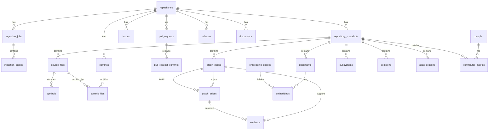

# Trace — Database Design

> PostgreSQL, pgvector, graph persistence, job state, evidence, and migration design for Trace.

This document defines the physical persistence model used by Trace.

Related documents:

- [`overview.md`](overview.md) — product context
- [`product.md`](product.md) — functional requirements
- [`architecture.md`](architecture.md) — system architecture
- [`ontology.md`](ontology.md) — logical entity and relationship model
- [`ai-system.md`](ai-system.md) — AI pipeline and retrieval
- [`api.md`](api.md) — HTTP contracts

---

## 1. Database Goals

The database must support:

- repository ingestion
- versioned repository snapshots
- resumable background jobs
- normalized GitHub artifacts
- source-file and symbol analysis
- ontology nodes and edges
- evidence-backed inference
- semantic retrieval with pgvector
- Atlas persistence
- evaluation and reproducibility
- safe retries
- future graph-backend replacement

---

## 2. Technology

MVP persistence stack:

```text
PostgreSQL 17
pgvector
SQLAlchemy 2.x
Alembic
psycopg
Redis 8
```

PostgreSQL is source of truth.

Redis is not source of truth.

Redis stores:

- queued job IDs
- temporary progress events
- distributed locks
- short-lived caches
- provider rate-limit state

---

## 3. Design Principles

## 3.1 PostgreSQL First

MVP stores:

- relational data
- ontology graph
- vectors
- Atlas output

in one database.

Benefits:

- simpler deployment
- transactional writes
- fewer operational dependencies
- easier local development
- easier backup and testing

## 3.2 Logical Graph Abstraction

Application code depends on:

```text
GraphRepository
```

MVP implementation:

```text
PostgresGraphRepository
```

Future implementation:

```text
Neo4jGraphRepository
```

Product services must not depend directly on PostgreSQL-specific graph SQL.

## 3.3 Snapshot-Aware Data

Mutable repository structure belongs to a repository snapshot.

Snapshot key:

```text
default branch HEAD commit SHA
```

## 3.4 Idempotent Writes

Every ingestion stage must support safe retry.

Use:

- unique provider IDs
- canonical ontology keys
- content hashes
- upserts
- stage transactions
- versioned outputs

## 3.5 Evidence as First-Class Data

Inferred entities and edges must reference persisted evidence.

## 3.6 JSONB With Limits

Use JSONB for flexible metadata.

Do not place core query fields only inside JSONB.

Frequently filtered, joined, sorted, or constrained fields need normal columns.

---

## 4. PostgreSQL Extensions

Required:

```sql
CREATE EXTENSION IF NOT EXISTS vector;
CREATE EXTENSION IF NOT EXISTS pgcrypto;
```

Optional later:

```sql
CREATE EXTENSION IF NOT EXISTS pg_trgm;
```

Uses:

- `vector` — semantic embeddings
- `pgcrypto` — UUID generation
- `pg_trgm` — fuzzy search

---

## 5. Schemas

Recommended PostgreSQL schemas:

```text
public
```

MVP may use `public` only.

Future separation:

```text
core
github
graph
ai
eval
```

Avoid premature schema complexity during MVP.

---

## 6. Naming Conventions

Tables:

```text
snake_case
plural
```

Columns:

```text
snake_case
```

Primary keys:

```text
id UUID
```

Foreign keys:

```text
{entity}_id
```

Provider identifiers:

```text
github_id
github_number
commit_sha
```

Timestamps:

```text
created_at
updated_at
```

Provider timestamps:

```text
provider_created_at
provider_updated_at
```

---

## 7. Common Column Types

| Purpose | PostgreSQL type |
|---|---|
| Internal ID | `uuid` |
| Provider numeric ID | `bigint` |
| Short string | `varchar` |
| Long text | `text` |
| Flexible metadata | `jsonb` |
| Timestamp | `timestamptz` |
| Confidence | `double precision` |
| Counts | `integer` or `bigint` |
| Content hash | `varchar(64)` |
| Vector | `vector` |
| Enum | PostgreSQL enum or constrained varchar |

---

## 8. Timestamp Policy

All timestamps:

```text
UTC
```

Database type:

```sql
timestamptz
```

Application responses:

```text
ISO 8601 UTC
```

Common defaults:

```sql
created_at timestamptz NOT NULL DEFAULT now(),
updated_at timestamptz NOT NULL DEFAULT now()
```

`updated_at` maintained by application or trigger.

---

## 9. Core Enums

Recommended enum values.

### Repository Status

```text
pending
validating
queued
ingesting
analyzing
generating
ready
partial
failed
```

### Analysis Mode

```text
full
reduced
```

### Job Status

```text
pending
queued
running
completed
partial
failed
cancelled
```

### Stage Status

```text
pending
running
completed
skipped
failed
```

### Knowledge Kind

```text
deterministic
derived
inferred
```

### Decision Status

```text
candidate
confirmed
insufficient_evidence
rejected
```

### Atlas Section Type

```text
overview
architecture
subsystems
timeline
decisions
contributors
explore
```

### Evidence Type

```text
artifact
source_span
graph_path
metric
provider_relation
model_inference
```

---

## 10. High-Level ERD



---

# 11. Repository Tables

## 11.1 `repositories`

Stores one GitHub repository.

```sql
CREATE TABLE repositories (
    id uuid PRIMARY KEY DEFAULT gen_random_uuid(),
    github_id bigint NOT NULL UNIQUE,
    owner varchar(255) NOT NULL,
    name varchar(255) NOT NULL,
    full_name varchar(511) NOT NULL UNIQUE,
    description text,
    default_branch varchar(255) NOT NULL,
    visibility varchar(32) NOT NULL DEFAULT 'public',
    primary_language varchar(100),
    source_url text NOT NULL,
    is_fork boolean NOT NULL DEFAULT false,
    is_archived boolean NOT NULL DEFAULT false,
    stars_count integer NOT NULL DEFAULT 0,
    forks_count integer NOT NULL DEFAULT 0,
    open_issues_count integer NOT NULL DEFAULT 0,
    status varchar(32) NOT NULL,
    analysis_mode varchar(32) NOT NULL DEFAULT 'full',
    analysis_limitations jsonb NOT NULL DEFAULT '[]'::jsonb,
    last_indexed_at timestamptz,
    provider_created_at timestamptz,
    provider_updated_at timestamptz,
    created_at timestamptz NOT NULL DEFAULT now(),
    updated_at timestamptz NOT NULL DEFAULT now(),

    CONSTRAINT repositories_visibility_check
        CHECK (visibility IN ('public')),

    CONSTRAINT repositories_status_check
        CHECK (status IN (
            'pending',
            'validating',
            'queued',
            'ingesting',
            'analyzing',
            'generating',
            'ready',
            'partial',
            'failed'
        )),

    CONSTRAINT repositories_analysis_mode_check
        CHECK (analysis_mode IN ('full', 'reduced'))
);
```

Indexes:

```sql
CREATE INDEX ix_repositories_owner
    ON repositories (owner);

CREATE INDEX ix_repositories_status
    ON repositories (status);

CREATE INDEX ix_repositories_primary_language
    ON repositories (primary_language);

CREATE INDEX ix_repositories_last_indexed_at
    ON repositories (last_indexed_at DESC);
```

---

## 11.2 `repository_snapshots`

Stores repository state at one commit.

```sql
CREATE TABLE repository_snapshots (
    id uuid PRIMARY KEY DEFAULT gen_random_uuid(),
    repository_id uuid NOT NULL REFERENCES repositories(id) ON DELETE CASCADE,
    head_commit_sha varchar(64) NOT NULL,
    default_branch varchar(255) NOT NULL,
    ontology_version varchar(50) NOT NULL,
    parser_version varchar(50) NOT NULL,
    graph_builder_version varchar(50) NOT NULL,
    atlas_generator_version varchar(50) NOT NULL,
    status varchar(32) NOT NULL,
    captured_at timestamptz NOT NULL DEFAULT now(),
    created_at timestamptz NOT NULL DEFAULT now(),

    CONSTRAINT uq_repository_snapshots_repository_sha
        UNIQUE (repository_id, head_commit_sha),

    CONSTRAINT repository_snapshots_status_check
        CHECK (status IN (
            'pending',
            'building',
            'ready',
            'partial',
            'failed'
        ))
);
```

Indexes:

```sql
CREATE INDEX ix_repository_snapshots_repository_captured
    ON repository_snapshots (repository_id, captured_at DESC);
```

---

# 12. Ingestion Tables

## 12.1 `ingestion_jobs`

```sql
CREATE TABLE ingestion_jobs (
    id uuid PRIMARY KEY DEFAULT gen_random_uuid(),
    repository_id uuid NOT NULL REFERENCES repositories(id) ON DELETE CASCADE,
    snapshot_id uuid REFERENCES repository_snapshots(id) ON DELETE SET NULL,
    retry_of_job_id uuid REFERENCES ingestion_jobs(id) ON DELETE SET NULL,
    status varchar(32) NOT NULL,
    current_stage varchar(100),
    progress integer NOT NULL DEFAULT 0,
    error_code varchar(100),
    error_message text,
    retryable boolean NOT NULL DEFAULT false,
    started_at timestamptz,
    completed_at timestamptz,
    created_at timestamptz NOT NULL DEFAULT now(),
    updated_at timestamptz NOT NULL DEFAULT now(),

    CONSTRAINT ingestion_jobs_progress_check
        CHECK (progress BETWEEN 0 AND 100),

    CONSTRAINT ingestion_jobs_status_check
        CHECK (status IN (
            'pending',
            'queued',
            'running',
            'completed',
            'partial',
            'failed',
            'cancelled'
        ))
);
```

Indexes:

```sql
CREATE INDEX ix_ingestion_jobs_repository_created
    ON ingestion_jobs (repository_id, created_at DESC);

CREATE INDEX ix_ingestion_jobs_status_created
    ON ingestion_jobs (status, created_at);

CREATE INDEX ix_ingestion_jobs_active
    ON ingestion_jobs (repository_id)
    WHERE status IN ('pending', 'queued', 'running');
```

Application rule:

Only one active job per repository.

Enforce using partial unique index:

```sql
CREATE UNIQUE INDEX uq_ingestion_jobs_one_active_per_repository
    ON ingestion_jobs (repository_id)
    WHERE status IN ('pending', 'queued', 'running');
```

---

## 12.2 `ingestion_stages`

```sql
CREATE TABLE ingestion_stages (
    id uuid PRIMARY KEY DEFAULT gen_random_uuid(),
    job_id uuid NOT NULL REFERENCES ingestion_jobs(id) ON DELETE CASCADE,
    name varchar(100) NOT NULL,
    sequence integer NOT NULL,
    status varchar(32) NOT NULL DEFAULT 'pending',
    progress integer NOT NULL DEFAULT 0,
    attempts integer NOT NULL DEFAULT 0,
    input_version varchar(100),
    output_version varchar(100),
    output_summary jsonb NOT NULL DEFAULT '{}'::jsonb,
    error_code varchar(100),
    error_message text,
    retryable boolean NOT NULL DEFAULT false,
    started_at timestamptz,
    completed_at timestamptz,
    created_at timestamptz NOT NULL DEFAULT now(),
    updated_at timestamptz NOT NULL DEFAULT now(),

    CONSTRAINT uq_ingestion_stages_job_name
        UNIQUE (job_id, name),

    CONSTRAINT ingestion_stages_progress_check
        CHECK (progress BETWEEN 0 AND 100),

    CONSTRAINT ingestion_stages_attempts_check
        CHECK (attempts >= 0),

    CONSTRAINT ingestion_stages_status_check
        CHECK (status IN (
            'pending',
            'running',
            'completed',
            'skipped',
            'failed'
        ))
);
```

Indexes:

```sql
CREATE INDEX ix_ingestion_stages_job_sequence
    ON ingestion_stages (job_id, sequence);
```

---

# 13. GitHub Artifact Tables

## 13.1 `people`

```sql
CREATE TABLE people (
    id uuid PRIMARY KEY DEFAULT gen_random_uuid(),
    github_id bigint UNIQUE,
    login varchar(255),
    display_name varchar(255),
    avatar_url text,
    profile_url text,
    is_bot boolean NOT NULL DEFAULT false,
    metadata jsonb NOT NULL DEFAULT '{}'::jsonb,
    created_at timestamptz NOT NULL DEFAULT now(),
    updated_at timestamptz NOT NULL DEFAULT now()
);
```

Rules:

- GitHub ID preferred identity.
- Git author email must not be merged with GitHub user without reliable evidence.
- Anonymous Git authors may use separate records with `github_id = NULL`.

---

## 13.2 `issues`

```sql
CREATE TABLE issues (
    id uuid PRIMARY KEY DEFAULT gen_random_uuid(),
    repository_id uuid NOT NULL REFERENCES repositories(id) ON DELETE CASCADE,
    github_id bigint NOT NULL,
    number integer NOT NULL,
    title text NOT NULL,
    body text,
    state varchar(32) NOT NULL,
    author_id uuid REFERENCES people(id) ON DELETE SET NULL,
    source_url text NOT NULL,
    provider_created_at timestamptz NOT NULL,
    provider_updated_at timestamptz,
    closed_at timestamptz,
    metadata jsonb NOT NULL DEFAULT '{}'::jsonb,
    created_at timestamptz NOT NULL DEFAULT now(),
    updated_at timestamptz NOT NULL DEFAULT now(),

    CONSTRAINT uq_issues_repository_github
        UNIQUE (repository_id, github_id),

    CONSTRAINT uq_issues_repository_number
        UNIQUE (repository_id, number)
);
```

Indexes:

```sql
CREATE INDEX ix_issues_repository_state
    ON issues (repository_id, state);

CREATE INDEX ix_issues_repository_created
    ON issues (repository_id, provider_created_at DESC);
```

---

## 13.3 `pull_requests`

```sql
CREATE TABLE pull_requests (
    id uuid PRIMARY KEY DEFAULT gen_random_uuid(),
    repository_id uuid NOT NULL REFERENCES repositories(id) ON DELETE CASCADE,
    github_id bigint NOT NULL,
    number integer NOT NULL,
    title text NOT NULL,
    body text,
    state varchar(32) NOT NULL,
    merged boolean NOT NULL DEFAULT false,
    author_id uuid REFERENCES people(id) ON DELETE SET NULL,
    base_branch varchar(255),
    head_branch varchar(255),
    source_url text NOT NULL,
    provider_created_at timestamptz NOT NULL,
    provider_updated_at timestamptz,
    merged_at timestamptz,
    closed_at timestamptz,
    metadata jsonb NOT NULL DEFAULT '{}'::jsonb,
    created_at timestamptz NOT NULL DEFAULT now(),
    updated_at timestamptz NOT NULL DEFAULT now(),

    CONSTRAINT uq_pull_requests_repository_github
        UNIQUE (repository_id, github_id),

    CONSTRAINT uq_pull_requests_repository_number
        UNIQUE (repository_id, number)
);
```

---

## 13.4 `commits`

```sql
CREATE TABLE commits (
    id uuid PRIMARY KEY DEFAULT gen_random_uuid(),
    repository_id uuid NOT NULL REFERENCES repositories(id) ON DELETE CASCADE,
    sha varchar(64) NOT NULL,
    message text NOT NULL,
    author_id uuid REFERENCES people(id) ON DELETE SET NULL,
    author_name varchar(255),
    author_email varchar(320),
    authored_at timestamptz,
    committed_at timestamptz,
    source_url text,
    metadata jsonb NOT NULL DEFAULT '{}'::jsonb,
    created_at timestamptz NOT NULL DEFAULT now(),

    CONSTRAINT uq_commits_repository_sha
        UNIQUE (repository_id, sha)
);
```

Indexes:

```sql
CREATE INDEX ix_commits_repository_committed
    ON commits (repository_id, committed_at DESC);
```

---

## 13.5 `commit_parents`

```sql
CREATE TABLE commit_parents (
    commit_id uuid NOT NULL REFERENCES commits(id) ON DELETE CASCADE,
    parent_commit_id uuid REFERENCES commits(id) ON DELETE CASCADE,
    parent_sha varchar(64) NOT NULL,
    position integer NOT NULL,
    PRIMARY KEY (commit_id, parent_sha)
);
```

`parent_commit_id` may remain null when parent commit is outside fetched history.

---

## 13.6 `releases`

```sql
CREATE TABLE releases (
    id uuid PRIMARY KEY DEFAULT gen_random_uuid(),
    repository_id uuid NOT NULL REFERENCES repositories(id) ON DELETE CASCADE,
    github_id bigint,
    tag_name varchar(255) NOT NULL,
    name text,
    body text,
    target_commitish varchar(255),
    draft boolean NOT NULL DEFAULT false,
    prerelease boolean NOT NULL DEFAULT false,
    source_url text,
    published_at timestamptz,
    metadata jsonb NOT NULL DEFAULT '{}'::jsonb,
    created_at timestamptz NOT NULL DEFAULT now(),
    updated_at timestamptz NOT NULL DEFAULT now(),

    CONSTRAINT uq_releases_repository_tag
        UNIQUE (repository_id, tag_name)
);
```

---

## 13.7 `discussions`

```sql
CREATE TABLE discussions (
    id uuid PRIMARY KEY DEFAULT gen_random_uuid(),
    repository_id uuid NOT NULL REFERENCES repositories(id) ON DELETE CASCADE,
    github_id bigint NOT NULL,
    number integer NOT NULL,
    title text NOT NULL,
    body text,
    category varchar(255),
    author_id uuid REFERENCES people(id) ON DELETE SET NULL,
    source_url text NOT NULL,
    provider_created_at timestamptz NOT NULL,
    provider_updated_at timestamptz,
    metadata jsonb NOT NULL DEFAULT '{}'::jsonb,
    created_at timestamptz NOT NULL DEFAULT now(),

    CONSTRAINT uq_discussions_repository_github
        UNIQUE (repository_id, github_id)
);
```

---

## 13.8 `labels`

```sql
CREATE TABLE labels (
    id uuid PRIMARY KEY DEFAULT gen_random_uuid(),
    repository_id uuid NOT NULL REFERENCES repositories(id) ON DELETE CASCADE,
    name varchar(255) NOT NULL,
    color varchar(16),
    description text,
    created_at timestamptz NOT NULL DEFAULT now(),

    CONSTRAINT uq_labels_repository_name
        UNIQUE (repository_id, name)
);
```

---

## 13.9 Artifact Join Tables

Examples:

```text
issue_labels
pull_request_labels
discussion_labels
pull_request_commits
pull_request_reviews
release_commits
artifact_references
```

### `pull_request_commits`

```sql
CREATE TABLE pull_request_commits (
    pull_request_id uuid NOT NULL REFERENCES pull_requests(id) ON DELETE CASCADE,
    commit_id uuid NOT NULL REFERENCES commits(id) ON DELETE CASCADE,
    position integer,
    PRIMARY KEY (pull_request_id, commit_id)
);
```

### `pull_request_reviews`

```sql
CREATE TABLE pull_request_reviews (
    id uuid PRIMARY KEY DEFAULT gen_random_uuid(),
    pull_request_id uuid NOT NULL REFERENCES pull_requests(id) ON DELETE CASCADE,
    github_id bigint NOT NULL,
    reviewer_id uuid REFERENCES people(id) ON DELETE SET NULL,
    state varchar(50),
    body text,
    submitted_at timestamptz,
    source_url text,
    created_at timestamptz NOT NULL DEFAULT now(),

    CONSTRAINT uq_pull_request_reviews_github
        UNIQUE (github_id)
);
```

---

# 14. Source Code Tables

## 14.1 `source_files`

```sql
CREATE TABLE source_files (
    id uuid PRIMARY KEY DEFAULT gen_random_uuid(),
    repository_id uuid NOT NULL REFERENCES repositories(id) ON DELETE CASCADE,
    snapshot_id uuid NOT NULL REFERENCES repository_snapshots(id) ON DELETE CASCADE,
    path text NOT NULL,
    filename varchar(1024) NOT NULL,
    extension varchar(50),
    language varchar(100),
    size_bytes bigint NOT NULL DEFAULT 0,
    line_count integer,
    content_hash varchar(64),
    blob_sha varchar(64),
    is_binary boolean NOT NULL DEFAULT false,
    is_generated boolean NOT NULL DEFAULT false,
    is_test boolean NOT NULL DEFAULT false,
    is_documentation boolean NOT NULL DEFAULT false,
    parse_status varchar(32) NOT NULL DEFAULT 'pending',
    parser_name varchar(100),
    parser_version varchar(50),
    source_url text,
    metadata jsonb NOT NULL DEFAULT '{}'::jsonb,
    created_at timestamptz NOT NULL DEFAULT now(),
    updated_at timestamptz NOT NULL DEFAULT now(),

    CONSTRAINT uq_source_files_snapshot_path
        UNIQUE (snapshot_id, path),

    CONSTRAINT source_files_size_check
        CHECK (size_bytes >= 0),

    CONSTRAINT source_files_parse_status_check
        CHECK (parse_status IN (
            'pending',
            'success',
            'partial',
            'failed',
            'skipped'
        ))
);
```

Indexes:

```sql
CREATE INDEX ix_source_files_snapshot_language
    ON source_files (snapshot_id, language);

CREATE INDEX ix_source_files_snapshot_path
    ON source_files (snapshot_id, path);

CREATE INDEX ix_source_files_content_hash
    ON source_files (content_hash);
```

---

## 14.2 `source_file_contents`

Optional separate table.

```sql
CREATE TABLE source_file_contents (
    source_file_id uuid PRIMARY KEY REFERENCES source_files(id) ON DELETE CASCADE,
    content text NOT NULL,
    content_encoding varchar(50) NOT NULL DEFAULT 'utf-8',
    created_at timestamptz NOT NULL DEFAULT now()
);
```

Why separate:

- reduce hot-row size
- avoid loading content during metadata queries
- easier future move to object storage

---

## 14.3 `symbols`

```sql
CREATE TABLE symbols (
    id uuid PRIMARY KEY DEFAULT gen_random_uuid(),
    repository_id uuid NOT NULL REFERENCES repositories(id) ON DELETE CASCADE,
    snapshot_id uuid NOT NULL REFERENCES repository_snapshots(id) ON DELETE CASCADE,
    source_file_id uuid NOT NULL REFERENCES source_files(id) ON DELETE CASCADE,
    canonical_key text NOT NULL,
    qualified_name text NOT NULL,
    local_name text NOT NULL,
    symbol_kind varchar(50) NOT NULL,
    signature text,
    docstring_summary text,
    start_line integer,
    end_line integer,
    exported boolean NOT NULL DEFAULT false,
    visibility varchar(50),
    parser_confidence double precision,
    metadata jsonb NOT NULL DEFAULT '{}'::jsonb,
    created_at timestamptz NOT NULL DEFAULT now(),

    CONSTRAINT uq_symbols_snapshot_canonical
        UNIQUE (snapshot_id, canonical_key),

    CONSTRAINT symbols_lines_check
        CHECK (
            start_line IS NULL
            OR end_line IS NULL
            OR end_line >= start_line
        ),

    CONSTRAINT symbols_confidence_check
        CHECK (
            parser_confidence IS NULL
            OR parser_confidence BETWEEN 0 AND 1
        )
);
```

Indexes:

```sql
CREATE INDEX ix_symbols_file
    ON symbols (source_file_id);

CREATE INDEX ix_symbols_snapshot_kind
    ON symbols (snapshot_id, symbol_kind);

CREATE INDEX ix_symbols_qualified_name
    ON symbols (qualified_name);
```

---

## 14.4 `commit_files`

```sql
CREATE TABLE commit_files (
    commit_id uuid NOT NULL REFERENCES commits(id) ON DELETE CASCADE,
    source_file_id uuid REFERENCES source_files(id) ON DELETE SET NULL,
    path text NOT NULL,
    previous_path text,
    status varchar(32) NOT NULL,
    additions integer,
    deletions integer,
    changes integer,
    patch text,
    PRIMARY KEY (commit_id, path)
);
```

`source_file_id` may be null when commit belongs to a different snapshot.

---

## 14.5 `external_dependencies`

```sql
CREATE TABLE external_dependencies (
    id uuid PRIMARY KEY DEFAULT gen_random_uuid(),
    repository_id uuid NOT NULL REFERENCES repositories(id) ON DELETE CASCADE,
    snapshot_id uuid NOT NULL REFERENCES repository_snapshots(id) ON DELETE CASCADE,
    ecosystem varchar(50) NOT NULL,
    package_name varchar(255) NOT NULL,
    version_constraint varchar(255),
    dependency_kind varchar(50) NOT NULL,
    source_manifest_path text,
    metadata jsonb NOT NULL DEFAULT '{}'::jsonb,
    created_at timestamptz NOT NULL DEFAULT now(),

    CONSTRAINT uq_external_dependencies_identity
        UNIQUE (
            snapshot_id,
            ecosystem,
            package_name,
            dependency_kind,
            source_manifest_path
        )
);
```

---

# 15. Ontology Graph Tables

## 15.1 `graph_nodes`

```sql
CREATE TABLE graph_nodes (
    id uuid PRIMARY KEY DEFAULT gen_random_uuid(),
    repository_id uuid NOT NULL REFERENCES repositories(id) ON DELETE CASCADE,
    snapshot_id uuid REFERENCES repository_snapshots(id) ON DELETE CASCADE,
    entity_type varchar(100) NOT NULL,
    canonical_key text NOT NULL,
    name text NOT NULL,
    description text,
    knowledge_kind varchar(32) NOT NULL,
    confidence double precision,
    provenance jsonb NOT NULL DEFAULT '{}'::jsonb,
    metadata jsonb NOT NULL DEFAULT '{}'::jsonb,
    ontology_version varchar(50) NOT NULL,
    created_at timestamptz NOT NULL DEFAULT now(),
    updated_at timestamptz NOT NULL DEFAULT now(),

    CONSTRAINT uq_graph_nodes_repository_canonical
        UNIQUE (repository_id, canonical_key),

    CONSTRAINT graph_nodes_knowledge_kind_check
        CHECK (knowledge_kind IN (
            'deterministic',
            'derived',
            'inferred'
        )),

    CONSTRAINT graph_nodes_confidence_check
        CHECK (
            confidence IS NULL
            OR confidence BETWEEN 0 AND 1
        ),

    CONSTRAINT graph_nodes_inferred_confidence_check
        CHECK (
            knowledge_kind = 'deterministic'
            OR confidence IS NOT NULL
        )
);
```

Indexes:

```sql
CREATE INDEX ix_graph_nodes_repository_type
    ON graph_nodes (repository_id, entity_type);

CREATE INDEX ix_graph_nodes_snapshot_type
    ON graph_nodes (snapshot_id, entity_type);

CREATE INDEX ix_graph_nodes_knowledge_kind
    ON graph_nodes (repository_id, knowledge_kind);

CREATE INDEX ix_graph_nodes_metadata_gin
    ON graph_nodes USING gin (metadata);
```

---

## 15.2 `graph_edges`

```sql
CREATE TABLE graph_edges (
    id uuid PRIMARY KEY DEFAULT gen_random_uuid(),
    repository_id uuid NOT NULL REFERENCES repositories(id) ON DELETE CASCADE,
    snapshot_id uuid REFERENCES repository_snapshots(id) ON DELETE CASCADE,
    source_node_id uuid NOT NULL REFERENCES graph_nodes(id) ON DELETE CASCADE,
    target_node_id uuid NOT NULL REFERENCES graph_nodes(id) ON DELETE CASCADE,
    relationship_type varchar(100) NOT NULL,
    knowledge_kind varchar(32) NOT NULL,
    confidence double precision,
    provenance jsonb NOT NULL DEFAULT '{}'::jsonb,
    metadata jsonb NOT NULL DEFAULT '{}'::jsonb,
    ontology_version varchar(50) NOT NULL,
    created_at timestamptz NOT NULL DEFAULT now(),
    updated_at timestamptz NOT NULL DEFAULT now(),

    CONSTRAINT uq_graph_edges_identity
        UNIQUE (
            repository_id,
            source_node_id,
            target_node_id,
            relationship_type
        ),

    CONSTRAINT graph_edges_no_self_loop
        CHECK (source_node_id <> target_node_id),

    CONSTRAINT graph_edges_knowledge_kind_check
        CHECK (knowledge_kind IN (
            'deterministic',
            'derived',
            'inferred'
        )),

    CONSTRAINT graph_edges_confidence_check
        CHECK (
            confidence IS NULL
            OR confidence BETWEEN 0 AND 1
        ),

    CONSTRAINT graph_edges_inferred_confidence_check
        CHECK (
            knowledge_kind = 'deterministic'
            OR confidence IS NOT NULL
        )
);
```

Indexes:

```sql
CREATE INDEX ix_graph_edges_source_type
    ON graph_edges (source_node_id, relationship_type);

CREATE INDEX ix_graph_edges_target_type
    ON graph_edges (target_node_id, relationship_type);

CREATE INDEX ix_graph_edges_repository_type
    ON graph_edges (repository_id, relationship_type);

CREATE INDEX ix_graph_edges_snapshot
    ON graph_edges (snapshot_id);
```

---

## 15.3 `graph_metrics`

```sql
CREATE TABLE graph_metrics (
    id uuid PRIMARY KEY DEFAULT gen_random_uuid(),
    repository_id uuid NOT NULL REFERENCES repositories(id) ON DELETE CASCADE,
    snapshot_id uuid NOT NULL REFERENCES repository_snapshots(id) ON DELETE CASCADE,
    node_id uuid NOT NULL REFERENCES graph_nodes(id) ON DELETE CASCADE,
    metric_name varchar(100) NOT NULL,
    metric_value double precision NOT NULL,
    algorithm varchar(100) NOT NULL,
    algorithm_version varchar(50) NOT NULL,
    graph_scope varchar(100) NOT NULL,
    metadata jsonb NOT NULL DEFAULT '{}'::jsonb,
    created_at timestamptz NOT NULL DEFAULT now(),

    CONSTRAINT uq_graph_metrics_identity
        UNIQUE (
            snapshot_id,
            node_id,
            metric_name,
            algorithm_version,
            graph_scope
        )
);
```

Indexes:

```sql
CREATE INDEX ix_graph_metrics_snapshot_name_value
    ON graph_metrics (snapshot_id, metric_name, metric_value DESC);
```

---

# 16. Evidence Tables

## 16.1 `evidence`

Evidence supports:

- graph nodes
- graph edges
- subsystems
- decisions
- Atlas sections
- query claims

```sql
CREATE TABLE evidence (
    id uuid PRIMARY KEY DEFAULT gen_random_uuid(),
    repository_id uuid NOT NULL REFERENCES repositories(id) ON DELETE CASCADE,
    snapshot_id uuid REFERENCES repository_snapshots(id) ON DELETE CASCADE,
    source_node_id uuid REFERENCES graph_nodes(id) ON DELETE SET NULL,
    target_node_id uuid REFERENCES graph_nodes(id) ON DELETE CASCADE,
    target_edge_id uuid REFERENCES graph_edges(id) ON DELETE CASCADE,
    evidence_type varchar(50) NOT NULL,
    relationship varchar(100) NOT NULL,
    content text,
    source_url text,
    start_line integer,
    end_line integer,
    knowledge_kind varchar(32) NOT NULL,
    confidence double precision,
    provenance jsonb NOT NULL DEFAULT '{}'::jsonb,
    created_at timestamptz NOT NULL DEFAULT now(),

    CONSTRAINT evidence_target_check
        CHECK (
            target_node_id IS NOT NULL
            OR target_edge_id IS NOT NULL
        ),

    CONSTRAINT evidence_type_check
        CHECK (evidence_type IN (
            'artifact',
            'source_span',
            'graph_path',
            'metric',
            'provider_relation',
            'model_inference'
        )),

    CONSTRAINT evidence_knowledge_kind_check
        CHECK (knowledge_kind IN (
            'deterministic',
            'derived',
            'inferred'
        )),

    CONSTRAINT evidence_confidence_check
        CHECK (
            confidence IS NULL
            OR confidence BETWEEN 0 AND 1
        ),

    CONSTRAINT evidence_lines_check
        CHECK (
            start_line IS NULL
            OR end_line IS NULL
            OR end_line >= start_line
        )
);
```

Indexes:

```sql
CREATE INDEX ix_evidence_target_node
    ON evidence (target_node_id);

CREATE INDEX ix_evidence_target_edge
    ON evidence (target_edge_id);

CREATE INDEX ix_evidence_source_node
    ON evidence (source_node_id);

CREATE INDEX ix_evidence_repository_type
    ON evidence (repository_id, evidence_type);
```

---

## 16.2 `evidence_paths`

For graph-path evidence.

```sql
CREATE TABLE evidence_paths (
    evidence_id uuid NOT NULL REFERENCES evidence(id) ON DELETE CASCADE,
    position integer NOT NULL,
    node_id uuid NOT NULL REFERENCES graph_nodes(id) ON DELETE CASCADE,
    edge_id uuid REFERENCES graph_edges(id) ON DELETE CASCADE,
    PRIMARY KEY (evidence_id, position)
);
```

---

# 17. Semantic Retrieval Tables

## 17.1 `documents`

```sql
CREATE TABLE documents (
    id uuid PRIMARY KEY DEFAULT gen_random_uuid(),
    repository_id uuid NOT NULL REFERENCES repositories(id) ON DELETE CASCADE,
    snapshot_id uuid REFERENCES repository_snapshots(id) ON DELETE CASCADE,
    source_node_id uuid REFERENCES graph_nodes(id) ON DELETE CASCADE,
    document_type varchar(50) NOT NULL,
    chunk_index integer NOT NULL,
    chunk_text text NOT NULL,
    token_count integer,
    content_hash varchar(64) NOT NULL,
    chunking_version varchar(50) NOT NULL,
    metadata jsonb NOT NULL DEFAULT '{}'::jsonb,
    created_at timestamptz NOT NULL DEFAULT now(),

    CONSTRAINT uq_documents_source_chunk
        UNIQUE (
            source_node_id,
            document_type,
            chunk_index,
            content_hash,
            chunking_version
        ),

    CONSTRAINT documents_chunk_index_check
        CHECK (chunk_index >= 0)
);
```

Indexes:

```sql
CREATE INDEX ix_documents_repository_type
    ON documents (repository_id, document_type);

CREATE INDEX ix_documents_source_node
    ON documents (source_node_id);

CREATE INDEX ix_documents_content_hash
    ON documents (content_hash);

CREATE INDEX ix_documents_metadata_gin
    ON documents USING gin (metadata);
```

---

## 17.2 `embedding_spaces`

Represents one embedding model and dimensional space.

```sql
CREATE TABLE embedding_spaces (
    id uuid PRIMARY KEY DEFAULT gen_random_uuid(),
    provider varchar(100) NOT NULL,
    model varchar(255) NOT NULL,
    model_version varchar(100),
    dimensions integer NOT NULL,
    distance_metric varchar(32) NOT NULL DEFAULT 'cosine',
    is_active boolean NOT NULL DEFAULT true,
    created_at timestamptz NOT NULL DEFAULT now(),

    CONSTRAINT uq_embedding_spaces_identity
        UNIQUE (provider, model, model_version, dimensions),

    CONSTRAINT embedding_spaces_dimensions_check
        CHECK (dimensions > 0),

    CONSTRAINT embedding_spaces_distance_check
        CHECK (distance_metric IN (
            'cosine',
            'inner_product',
            'l2'
        ))
);
```

---

## 17.3 `embeddings`

Use generic `vector` to allow multiple dimensions.

```sql
CREATE TABLE embeddings (
    id uuid PRIMARY KEY DEFAULT gen_random_uuid(),
    document_id uuid NOT NULL REFERENCES documents(id) ON DELETE CASCADE,
    embedding_space_id uuid NOT NULL REFERENCES embedding_spaces(id) ON DELETE RESTRICT,
    embedding vector NOT NULL,
    created_at timestamptz NOT NULL DEFAULT now(),

    CONSTRAINT uq_embeddings_document_space
        UNIQUE (document_id, embedding_space_id)
);
```

Important:

`vector` without fixed dimensions supports multiple embedding spaces.

Application validation must confirm:

```text
vector dimensions == embedding_spaces.dimensions
```

Use a database trigger later if needed.

---

## 17.4 Vector Index Strategy

pgvector ANN indexes require a known dimension.

Create one partial expression index per active embedding space.

Example for 384-dimensional local model:

```sql
CREATE INDEX ix_embeddings_local_384_hnsw
ON embeddings
USING hnsw ((embedding::vector(384)) vector_cosine_ops)
WHERE embedding_space_id = '00000000-0000-0000-0000-000000000384';
```

Example query:

```sql
SELECT
    e.document_id,
    1 - (
        e.embedding::vector(384)
        <=>
        CAST(:query_embedding AS vector(384))
    ) AS similarity
FROM embeddings e
WHERE e.embedding_space_id = :embedding_space_id
ORDER BY
    e.embedding::vector(384)
    <=>
    CAST(:query_embedding AS vector(384))
LIMIT :limit;
```

MVP simplification:

- configure one active embedding space
- create one matching HNSW index
- add another partial index when adding a different dimension

---

## 17.5 Full-Text Search

Optional generated search vector:

```sql
ALTER TABLE documents
ADD COLUMN search_vector tsvector
GENERATED ALWAYS AS (
    to_tsvector('english', coalesce(chunk_text, ''))
) STORED;
```

Index:

```sql
CREATE INDEX ix_documents_search_vector
    ON documents USING gin (search_vector);
```

Hybrid search combines:

- exact/prefix match
- PostgreSQL full-text rank
- vector similarity
- graph proximity

---

# 18. Inferred Knowledge Tables

## 18.1 `subsystems`

```sql
CREATE TABLE subsystems (
    id uuid PRIMARY KEY DEFAULT gen_random_uuid(),
    repository_id uuid NOT NULL REFERENCES repositories(id) ON DELETE CASCADE,
    snapshot_id uuid NOT NULL REFERENCES repository_snapshots(id) ON DELETE CASCADE,
    graph_node_id uuid NOT NULL UNIQUE REFERENCES graph_nodes(id) ON DELETE CASCADE,
    name varchar(255) NOT NULL,
    slug varchar(255) NOT NULL,
    summary text NOT NULL,
    status varchar(32) NOT NULL,
    confidence double precision NOT NULL,
    discovery_method varchar(100) NOT NULL,
    discovery_signals jsonb NOT NULL DEFAULT '[]'::jsonb,
    stability_score double precision,
    generator_version varchar(50) NOT NULL,
    created_at timestamptz NOT NULL DEFAULT now(),
    updated_at timestamptz NOT NULL DEFAULT now(),

    CONSTRAINT uq_subsystems_snapshot_slug
        UNIQUE (snapshot_id, slug),

    CONSTRAINT subsystems_status_check
        CHECK (status IN ('confirmed', 'candidate')),

    CONSTRAINT subsystems_confidence_check
        CHECK (confidence BETWEEN 0 AND 1),

    CONSTRAINT subsystems_stability_check
        CHECK (
            stability_score IS NULL
            OR stability_score BETWEEN 0 AND 1
        )
);
```

Membership is stored through graph edges:

```text
File --PART_OF_SUBSYSTEM--> Subsystem
Directory --PART_OF_SUBSYSTEM--> Subsystem
Symbol --PART_OF_SUBSYSTEM--> Subsystem
```

---

## 18.2 `decisions`

```sql
CREATE TABLE decisions (
    id uuid PRIMARY KEY DEFAULT gen_random_uuid(),
    repository_id uuid NOT NULL REFERENCES repositories(id) ON DELETE CASCADE,
    snapshot_id uuid NOT NULL REFERENCES repository_snapshots(id) ON DELETE CASCADE,
    graph_node_id uuid NOT NULL UNIQUE REFERENCES graph_nodes(id) ON DELETE CASCADE,
    title text NOT NULL,
    context text,
    decision text,
    alternatives jsonb NOT NULL DEFAULT '[]'::jsonb,
    outcome text,
    status varchar(32) NOT NULL,
    confidence double precision NOT NULL,
    decision_date timestamptz,
    extraction_method varchar(100) NOT NULL,
    generator_version varchar(50) NOT NULL,
    created_at timestamptz NOT NULL DEFAULT now(),
    updated_at timestamptz NOT NULL DEFAULT now(),

    CONSTRAINT decisions_status_check
        CHECK (status IN (
            'candidate',
            'confirmed',
            'insufficient_evidence',
            'rejected'
        )),

    CONSTRAINT decisions_confidence_check
        CHECK (confidence BETWEEN 0 AND 1)
);
```

Application rule:

A `confirmed` decision must have at least one non-model evidence record.

Enforce in service layer.

Potential deferred constraint trigger later.

---

## 18.3 `learning_steps`

```sql
CREATE TABLE learning_steps (
    id uuid PRIMARY KEY DEFAULT gen_random_uuid(),
    repository_id uuid NOT NULL REFERENCES repositories(id) ON DELETE CASCADE,
    snapshot_id uuid NOT NULL REFERENCES repository_snapshots(id) ON DELETE CASCADE,
    graph_node_id uuid NOT NULL UNIQUE REFERENCES graph_nodes(id) ON DELETE CASCADE,
    step_order integer NOT NULL,
    title text NOT NULL,
    rationale text NOT NULL,
    difficulty varchar(32),
    target_node_id uuid REFERENCES graph_nodes(id) ON DELETE SET NULL,
    confidence double precision NOT NULL,
    generator_version varchar(50) NOT NULL,
    created_at timestamptz NOT NULL DEFAULT now(),

    CONSTRAINT uq_learning_steps_snapshot_order
        UNIQUE (snapshot_id, step_order),

    CONSTRAINT learning_steps_order_check
        CHECK (step_order > 0),

    CONSTRAINT learning_steps_confidence_check
        CHECK (confidence BETWEEN 0 AND 1)
);
```

---

# 19. Contributor Tables

## 19.1 `contributor_metrics`

```sql
CREATE TABLE contributor_metrics (
    id uuid PRIMARY KEY DEFAULT gen_random_uuid(),
    repository_id uuid NOT NULL REFERENCES repositories(id) ON DELETE CASCADE,
    snapshot_id uuid NOT NULL REFERENCES repository_snapshots(id) ON DELETE CASCADE,
    person_id uuid NOT NULL REFERENCES people(id) ON DELETE CASCADE,
    subsystem_id uuid REFERENCES subsystems(id) ON DELETE CASCADE,
    authored_pr_score double precision NOT NULL DEFAULT 0,
    reviewed_pr_score double precision NOT NULL DEFAULT 0,
    commit_score double precision NOT NULL DEFAULT 0,
    subsystem_file_score double precision NOT NULL DEFAULT 0,
    recency_score double precision NOT NULL DEFAULT 0,
    expertise_score double precision NOT NULL DEFAULT 0,
    activity_count integer NOT NULL DEFAULT 0,
    last_activity_at timestamptz,
    scoring_version varchar(50) NOT NULL,
    metadata jsonb NOT NULL DEFAULT '{}'::jsonb,
    created_at timestamptz NOT NULL DEFAULT now(),

    CONSTRAINT uq_contributor_metrics_identity
        UNIQUE (snapshot_id, person_id, subsystem_id),

    CONSTRAINT contributor_metrics_scores_check
        CHECK (
            authored_pr_score BETWEEN 0 AND 1
            AND reviewed_pr_score BETWEEN 0 AND 1
            AND commit_score BETWEEN 0 AND 1
            AND subsystem_file_score BETWEEN 0 AND 1
            AND recency_score BETWEEN 0 AND 1
            AND expertise_score BETWEEN 0 AND 1
        )
);
```

A row with `subsystem_id = NULL` represents repository-wide metrics.

PostgreSQL unique constraints treat nulls as distinct.

Use PostgreSQL 15+:

```sql
CREATE UNIQUE INDEX uq_contributor_metrics_repository_wide
    ON contributor_metrics (snapshot_id, person_id)
    WHERE subsystem_id IS NULL;
```

---

# 20. Atlas Tables

## 20.1 `atlas_sections`

```sql
CREATE TABLE atlas_sections (
    id uuid PRIMARY KEY DEFAULT gen_random_uuid(),
    repository_id uuid NOT NULL REFERENCES repositories(id) ON DELETE CASCADE,
    snapshot_id uuid NOT NULL REFERENCES repository_snapshots(id) ON DELETE CASCADE,
    section_type varchar(50) NOT NULL,
    status varchar(32) NOT NULL,
    payload jsonb NOT NULL,
    limitations jsonb NOT NULL DEFAULT '[]'::jsonb,
    generator_version varchar(50) NOT NULL,
    generated_at timestamptz NOT NULL DEFAULT now(),
    updated_at timestamptz NOT NULL DEFAULT now(),

    CONSTRAINT uq_atlas_sections_snapshot_type
        UNIQUE (snapshot_id, section_type),

    CONSTRAINT atlas_sections_type_check
        CHECK (section_type IN (
            'overview',
            'architecture',
            'subsystems',
            'timeline',
            'decisions',
            'contributors',
            'explore'
        )),

    CONSTRAINT atlas_sections_status_check
        CHECK (status IN (
            'pending',
            'ready',
            'partial',
            'failed'
        ))
);
```

Indexes:

```sql
CREATE INDEX ix_atlas_sections_repository_type
    ON atlas_sections (repository_id, section_type);
```

---

## 20.2 `atlas_section_evidence`

```sql
CREATE TABLE atlas_section_evidence (
    atlas_section_id uuid NOT NULL REFERENCES atlas_sections(id) ON DELETE CASCADE,
    evidence_id uuid NOT NULL REFERENCES evidence(id) ON DELETE CASCADE,
    position integer,
    PRIMARY KEY (atlas_section_id, evidence_id)
);
```

---

# 21. Query and Evaluation Tables

MVP Ask history may remain session-local.

Evaluation needs persistence.

## 21.1 `evaluation_datasets`

```sql
CREATE TABLE evaluation_datasets (
    id uuid PRIMARY KEY DEFAULT gen_random_uuid(),
    name varchar(255) NOT NULL,
    version varchar(50) NOT NULL,
    description text,
    created_at timestamptz NOT NULL DEFAULT now(),

    CONSTRAINT uq_evaluation_datasets_name_version
        UNIQUE (name, version)
);
```

## 21.2 `evaluation_cases`

```sql
CREATE TABLE evaluation_cases (
    id uuid PRIMARY KEY DEFAULT gen_random_uuid(),
    dataset_id uuid NOT NULL REFERENCES evaluation_datasets(id) ON DELETE CASCADE,
    repository_id uuid NOT NULL REFERENCES repositories(id) ON DELETE CASCADE,
    snapshot_id uuid NOT NULL REFERENCES repository_snapshots(id) ON DELETE CASCADE,
    question text NOT NULL,
    category varchar(100) NOT NULL,
    expected_answer text,
    gold_evidence_ids uuid[] NOT NULL DEFAULT '{}',
    metadata jsonb NOT NULL DEFAULT '{}'::jsonb,
    created_at timestamptz NOT NULL DEFAULT now()
);
```

## 21.3 `evaluation_runs`

```sql
CREATE TABLE evaluation_runs (
    id uuid PRIMARY KEY DEFAULT gen_random_uuid(),
    dataset_id uuid NOT NULL REFERENCES evaluation_datasets(id) ON DELETE CASCADE,
    strategy varchar(100) NOT NULL,
    config jsonb NOT NULL,
    status varchar(32) NOT NULL,
    started_at timestamptz,
    completed_at timestamptz,
    created_at timestamptz NOT NULL DEFAULT now()
);
```

## 21.4 `evaluation_results`

```sql
CREATE TABLE evaluation_results (
    id uuid PRIMARY KEY DEFAULT gen_random_uuid(),
    run_id uuid NOT NULL REFERENCES evaluation_runs(id) ON DELETE CASCADE,
    case_id uuid NOT NULL REFERENCES evaluation_cases(id) ON DELETE CASCADE,
    answer text,
    retrieved_evidence_ids uuid[] NOT NULL DEFAULT '{}',
    metrics jsonb NOT NULL DEFAULT '{}'::jsonb,
    latency_ms integer,
    token_usage jsonb NOT NULL DEFAULT '{}'::jsonb,
    cost_estimate numeric(12, 6),
    error_code varchar(100),
    created_at timestamptz NOT NULL DEFAULT now(),

    CONSTRAINT uq_evaluation_results_run_case
        UNIQUE (run_id, case_id)
);
```

---

# 22. Relationship Integrity

The ontology defines allowed source/target pairs.

Database FKs ensure entity existence.

Application validation ensures relationship semantics.

Example:

```text
Person --AUTHORED--> PullRequest
```

Allowed.

```text
PullRequest --AUTHORED--> Person
```

Rejected by graph validation.

Reason:

A database CHECK cannot efficiently inspect both referenced node types without triggers.

MVP uses service-layer validation plus tests.

---

# 23. Transaction Boundaries

Use one transaction per coherent stage batch.

Examples:

## Artifact Batch

```text
upsert issues
upsert labels
upsert issue-label joins
commit
```

## Source Parse Batch

```text
upsert source file
replace symbols
replace import edges
commit
```

## Inference Batch

```text
create inferred graph node
create evidence
create subtype row
commit
```

Never publish inferred entity before its evidence commits.

---

# 24. Upsert Strategy

PostgreSQL:

```sql
INSERT ...
ON CONFLICT (...) DO UPDATE
```

Examples:

- repositories by `github_id`
- issues by `(repository_id, github_id)`
- commits by `(repository_id, sha)`
- files by `(snapshot_id, path)`
- graph nodes by `(repository_id, canonical_key)`
- graph edges by relationship identity
- embeddings by `(document_id, embedding_space_id)`

---

# 25. Delete Strategy

## 25.1 Repository Delete

Future admin operation.

`ON DELETE CASCADE` removes repository-owned data.

## 25.2 Snapshot Rebuild

Prefer creating new snapshot.

Do not mutate old ready snapshot.

## 25.3 Failed Snapshot Cleanup

Failed incomplete snapshots may be retained for debugging or removed by retention policy.

## 25.4 Soft Delete

Not required for MVP.

Future user workspaces may need soft deletion.

---

# 26. Retention

Suggested MVP policy:

- ready snapshots: retain
- latest failed job: retain
- old failed job logs: retain 30 days
- Redis progress events: retain minutes/hours
- cached query data: bounded TTL
- model request payloads: do not store unless needed for evaluation
- raw provider responses: optional and bounded

---

# 27. Redis Key Design

Examples:

```text
trace:queue:ingestion
trace:job:{job_id}:progress
trace:lock:repository:{repository_id}
trace:github:rate_limit
trace:cache:atlas:{snapshot_id}:{section}
trace:cache:graph:{snapshot_id}:{hash}
```

Rules:

- namespace every key with `trace`
- set TTL for cache/progress keys
- no persistent-only data in Redis
- lock values include owner token
- release locks safely

---

# 28. Query Patterns

## 28.1 Latest Ready Snapshot

```sql
SELECT *
FROM repository_snapshots
WHERE repository_id = :repository_id
  AND status IN ('ready', 'partial')
ORDER BY captured_at DESC
LIMIT 1;
```

## 28.2 Subsystem Files

```sql
SELECT file_node.*
FROM graph_edges edge
JOIN graph_nodes file_node
  ON file_node.id = edge.source_node_id
WHERE edge.target_node_id = :subsystem_node_id
  AND edge.relationship_type = 'PART_OF_SUBSYSTEM'
  AND file_node.entity_type = 'File';
```

## 28.3 Node Neighbors

```sql
SELECT
    edge.*,
    target.*
FROM graph_edges edge
JOIN graph_nodes target
  ON target.id = edge.target_node_id
WHERE edge.source_node_id = :node_id
  AND edge.relationship_type = ANY(:relationship_types)
ORDER BY edge.confidence DESC NULLS FIRST
LIMIT :limit;
```

## 28.4 Confirmed Decisions

```sql
SELECT *
FROM decisions
WHERE snapshot_id = :snapshot_id
  AND status = 'confirmed'
ORDER BY decision_date DESC NULLS LAST;
```

## 28.5 Top Contributors by Subsystem

```sql
SELECT
    person.login,
    metric.expertise_score,
    metric.last_activity_at
FROM contributor_metrics metric
JOIN people person
  ON person.id = metric.person_id
WHERE metric.snapshot_id = :snapshot_id
  AND metric.subsystem_id = :subsystem_id
ORDER BY metric.expertise_score DESC
LIMIT 10;
```

---

# 29. Recursive Graph Queries

PostgreSQL recursive CTE supports bounded traversal.

Example:

```sql
WITH RECURSIVE traversal AS (
    SELECT
        edge.source_node_id,
        edge.target_node_id,
        edge.id AS edge_id,
        1 AS depth,
        ARRAY[edge.source_node_id, edge.target_node_id] AS path
    FROM graph_edges edge
    WHERE edge.source_node_id = :start_node_id

    UNION ALL

    SELECT
        edge.source_node_id,
        edge.target_node_id,
        edge.id,
        traversal.depth + 1,
        traversal.path || edge.target_node_id
    FROM graph_edges edge
    JOIN traversal
      ON edge.source_node_id = traversal.target_node_id
    WHERE traversal.depth < :max_depth
      AND NOT edge.target_node_id = ANY(traversal.path)
)
SELECT *
FROM traversal;
```

MVP limits:

```text
max depth: 3
max returned nodes: 500
```

---

# 30. Indexing Strategy

Index fields used for:

- joins
- uniqueness
- status filtering
- date sorting
- graph traversal
- vector search
- text search

Avoid indexing:

- rarely queried JSONB keys
- every metadata field
- large text columns directly

Use `EXPLAIN ANALYZE` before adding speculative indexes.

---

# 31. JSONB Strategy

Good JSONB uses:

- provider metadata
- analysis limitations
- discovery signals
- model provenance
- evaluation metrics
- Atlas payloads

Bad JSONB uses:

- repository owner
- status
- timestamps
- confidence
- foreign keys
- common filters

---

# 32. Partitioning

Not needed for MVP.

Potential future partition candidates:

- documents
- embeddings
- graph_edges
- evaluation_results
- commits

Partition by:

- repository
- snapshot
- created date

Only add after measured need.

---

# 33. Concurrency

Use:

- database transactions
- partial unique index for active jobs
- repository-level Redis lock
- optimistic upserts
- stage ownership

Worker must not process same repository snapshot concurrently.

---

# 34. Isolation Level

Default:

```text
READ COMMITTED
```

Use explicit row locking for state transitions.

Example:

```sql
SELECT *
FROM ingestion_jobs
WHERE id = :job_id
FOR UPDATE;
```

Avoid long-running transactions during external API/model calls.

Pattern:

```text
read state
commit
call provider
begin new transaction
persist result
commit
```

---

# 35. Migration Strategy

Alembic manages schema.

Rules:

- migration files committed
- migrations reviewed
- no destructive migration without backup plan
- data backfills separated when large
- CI tests fresh migration
- CI tests upgrade from previous revision when practical

Commands:

```bash
cd backend
uv run alembic revision --autogenerate -m "create repositories"
uv run alembic upgrade head
uv run alembic downgrade -1
```

Never edit applied production migration.

Create new migration.

---

# 36. Seed Data

Seed only:

- development sample repository records when useful
- embedding-space configuration
- evaluation datasets

Do not seed fake production Atlas data.

---

# 37. SQLAlchemy Mapping

Recommended layers:

```text
domain model
repository interface
SQLAlchemy model
mapper
```

Avoid returning ORM objects directly from API.

Example:

```python
class RepositoryRepository(Protocol):
    async def get(self, repository_id: UUID) -> Repository | None: ...
    async def upsert(self, repository: Repository) -> Repository: ...
```

SQLAlchemy sessions:

- one request-scoped session for API
- one task-scoped session for worker stage
- explicit commit
- rollback on exception

---

# 38. Testing

## 38.1 Migration Tests

- new database upgrades to head
- extension creation works
- constraints exist
- downgrade tested for recent migrations

## 38.2 Repository Tests

- upsert idempotency
- cascade behavior
- partial unique active job
- graph node uniqueness
- graph edge uniqueness
- confidence constraints
- confirmed decision evidence rule

## 38.3 pgvector Tests

- vector insertion
- dimension validation
- similarity ordering
- embedding-space filtering
- index query plan later

## 38.4 Integration Database

Use real PostgreSQL with pgvector.

Do not replace graph/vector integration tests with SQLite.

---

# 39. Backups and Recovery

Production-like deployment should support:

- automated PostgreSQL backups
- point-in-time recovery when available
- migration rollback plan
- tested restore
- encrypted backup storage

Redis backup not required for queue/progress correctness.

---

# 40. Security

- database credentials from environment
- least-privilege DB role
- no public DB port in production
- TLS for remote DB
- parameterized SQL
- secrets never stored in tables
- source content treated as untrusted
- user-facing queries scoped by repository
- internal error details not exposed

---

# 41. Performance Targets

For supported repository size:

- repository read: under 100 ms DB time
- Overview read: under 500 ms uncached DB time
- bounded graph expansion: under 1 second
- vector top-k retrieval: under 500 ms
- ingestion batch upsert: bounded memory
- progress status read: under 100 ms

Targets require measured query plans.

---

# 42. Future Neo4j Migration

Graph abstraction allows:

```text
PostgreSQL relational data
+
Neo4j graph data
```

Potential split:

PostgreSQL retains:

- repositories
- snapshots
- jobs
- artifacts
- evidence metadata
- Atlas
- vectors

Neo4j stores:

- graph nodes
- graph edges
- traversal indexes

Do not migrate until:

- deep graph queries become slow
- graph scale exceeds PostgreSQL comfort
- Neo4j materially improves product/evaluation

---

# 43. Schema Delivery Order

Recommended migration order:

```text
1. extensions
2. repositories
3. repository_snapshots
4. ingestion_jobs
5. ingestion_stages
6. people
7. GitHub artifacts
8. source_files
9. symbols
10. graph_nodes
11. graph_edges
12. graph_metrics
13. evidence
14. documents
15. embedding_spaces
16. embeddings
17. subsystems
18. decisions
19. contributor_metrics
20. atlas_sections
21. evaluation tables
22. search/vector indexes
```

---

# 44. Definition of Database Success

Database design succeeds when:

- retries do not duplicate data
- repository snapshots remain reproducible
- job progress persists across restarts
- graph traversal is bounded and usable
- every inference links to evidence
- vector retrieval filters by repository and snapshot
- model/version metadata is preserved
- partial Atlas output remains queryable
- migrations are repeatable
- PostgreSQL can later yield graph duties to Neo4j

---

## Final Database Rule

> PostgreSQL stores repository facts, graph structure, semantic vectors, generated knowledge, and evidence without allowing inferred output to become detached from its source.
