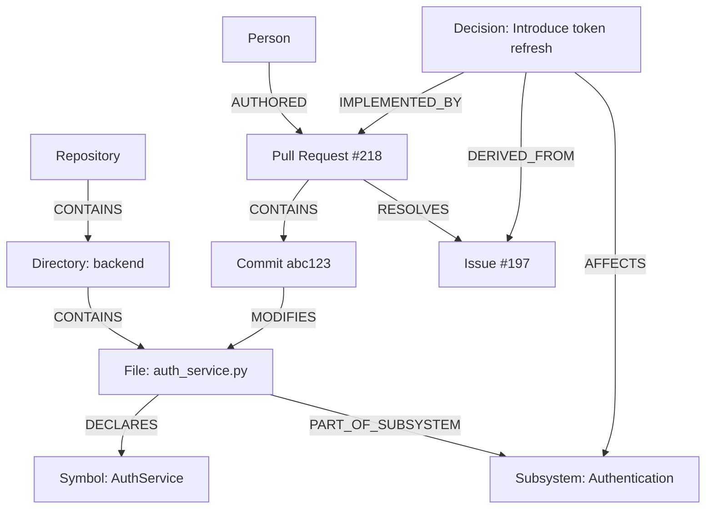

# Trace — Repository Ontology

> Canonical knowledge model for representing software repositories as structured, explainable graphs.

This document defines the entities, relationships, evidence rules, inference rules, identifiers, constraints, and versioning used by Trace.

Related documents:

- [`overview.md`](overview.md) — product context
- [`product.md`](product.md) — functional requirements
- [`architecture.md`](architecture.md) — system design
- [`ai-system.md`](ai-system.md) — extraction and reasoning
- [`database.md`](database.md) — persistence mapping
- [`api.md`](api.md) — external contracts
- [`evaluation.md`](evaluation.md) — ontology quality evaluation

---

## 1. Purpose

Trace cannot explain software reliably if it treats a repository as unrelated text chunks.

The repository ontology gives Trace a common language for representing:

- source structure
- software artifacts
- historical events
- contributor activity
- dependencies
- inferred architecture
- inferred decisions
- learning order
- evidence
- uncertainty

The ontology is used by:

- ingestion
- parsing
- graph construction
- subsystem discovery
- decision extraction
- contributor analysis
- retrieval
- reasoning
- evaluation
- UI visualization

---

## 2. Design Goals

The ontology must be:

### 2.1 Software-Specific

It must model repository concepts directly.

Examples:

- File
- Symbol
- PullRequest
- Commit
- Subsystem
- Decision

### 2.2 Evidence-Backed

Every inferred entity and relationship must point to supporting evidence.

### 2.3 Snapshot-Aware

Knowledge belongs to a repository snapshot.

A file, symbol, import, or subsystem may change across snapshots.

### 2.4 Explainable

Users must be able to inspect:

- what was observed
- what was inferred
- how it was inferred
- confidence
- supporting evidence

### 2.5 Provider-Neutral

The ontology must not depend on one GitHub SDK, model provider, or database.

### 2.6 Extensible

New entity and relationship types may be added without breaking prior data.

### 2.7 Deterministic Where Possible

Exact repository facts should not be generated by an LLM.

---

## 3. Knowledge Layers

Trace separates repository knowledge into four layers.

## 3.1 Source Layer

Raw provider artifacts.

Examples:

- repository metadata
- issue body
- pull-request title
- commit message
- file content
- release notes

## 3.2 Structural Layer

Deterministically extracted relationships.

Examples:

- directory contains file
- file imports file
- commit modifies file
- pull request contains commit
- issue referenced by pull request

## 3.3 Analytical Layer

Derived from graph algorithms and heuristics.

Examples:

- centrality score
- community membership
- dependency cycle
- contributor activity score

## 3.4 Semantic Layer

AI-assisted or heuristic interpretation.

Examples:

- subsystem
- decision
- architecture summary
- topic
- learning step

The semantic layer must never erase or replace the structural layer.

---

## 4. Entity Classification

Every entity is classified as one of:

```text
deterministic
derived
inferred
```

## 4.1 Deterministic Entity

Directly obtained from provider data or parser output.

Examples:

- File
- Commit
- Issue
- Symbol

## 4.2 Derived Entity

Produced by deterministic computation over repository facts.

Examples:

- graph metric
- dependency cycle
- contributor score snapshot

## 4.3 Inferred Entity

Produced using heuristics, embeddings, clustering, or LLM reasoning.

Examples:

- Subsystem
- Decision
- Topic
- LearningStep

---

## 5. Entity Base Model

Every ontology entity must contain the following fields.

```text
id
repository_id
snapshot_id
entity_type
canonical_key
name
description
knowledge_kind
confidence
provenance
metadata
created_at
updated_at
```

## 5.1 Required Field Semantics

### `id`

Internal stable UUID.

### `repository_id`

Owning repository.

### `snapshot_id`

Repository snapshot where the entity exists.

### `entity_type`

Ontology entity type.

### `canonical_key`

Stable key used for idempotent upsert.

### `name`

Human-readable label.

### `description`

Optional explanation.

### `knowledge_kind`

One of:

```text
deterministic
derived
inferred
```

### `confidence`

Nullable for deterministic facts.

Required for derived and inferred entities.

### `provenance`

Structured origin information.

### `metadata`

Type-specific structured data.

---

## 6. Canonical Identity

Entities must use deterministic canonical keys where possible.

Examples:

```text
Repository:
github:repository:{github_repository_id}

Directory:
repo:{repository_id}:snapshot:{snapshot_id}:directory:{normalized_path}

File:
repo:{repository_id}:snapshot:{snapshot_id}:file:{normalized_path}

Symbol:
repo:{repository_id}:snapshot:{snapshot_id}:symbol:{file_path}:{qualified_name}:{symbol_kind}

Issue:
github:issue:{repository_id}:{issue_number}

PullRequest:
github:pull_request:{repository_id}:{pull_request_number}

Commit:
github:commit:{repository_id}:{commit_sha}

Release:
github:release:{repository_id}:{release_id}

Person:
github:user:{github_user_id}

Subsystem:
repo:{repository_id}:snapshot:{snapshot_id}:subsystem:{generated_slug}:{generator_version}
```

Canonical keys must:

- be unique within intended scope
- be reproducible
- avoid display names as sole identity
- include snapshot for mutable source entities
- include generator version for inferred entities where needed

---

## 7. Core Entity Types

# 7.1 Repository

Represents one source repository.

Knowledge kind:

```text
deterministic
```

Core attributes:

- provider
- provider_repository_id
- owner
- name
- full_name
- description
- default_branch
- visibility
- is_fork
- is_archived
- primary_language
- stars
- forks
- open_issue_count
- created_at_provider
- updated_at_provider
- source_url

Example:

```json
{
  "entity_type": "Repository",
  "canonical_key": "github:repository:496433691",
  "name": "trace",
  "metadata": {
    "owner": "kumari-anushka",
    "default_branch": "main",
    "visibility": "public"
  }
}
```

---

# 7.2 RepositorySnapshot

Represents repository state at a specific default-branch commit.

Knowledge kind:

```text
deterministic
```

Core attributes:

- repository_id
- head_commit_sha
- default_branch
- captured_at
- ingestion_version
- status

Purpose:

- reproducibility
- cache correctness
- Atlas versioning
- evaluation consistency
- future incremental sync

---

# 7.3 Directory

Represents a repository directory.

Knowledge kind:

```text
deterministic
```

Core attributes:

- path
- depth
- parent_path
- file_count
- directory_count

Constraints:

- path normalized
- root represented consistently
- belongs to one snapshot

---

# 7.4 File

Represents one file in a snapshot.

Knowledge kind:

```text
deterministic
```

Core attributes:

- path
- filename
- extension
- language
- size_bytes
- content_hash
- blob_sha
- line_count
- is_binary
- is_generated
- is_test
- is_documentation
- source_url

File contents may be stored separately from ontology metadata.

---

# 7.5 Symbol

Represents a parsed software symbol.

Knowledge kind:

```text
deterministic
```

Supported symbol kinds:

```text
module
class
function
method
interface
type
enum
variable
constant
component
hook
route
```

Core attributes:

- qualified_name
- local_name
- symbol_kind
- file_path
- start_line
- end_line
- signature
- exported
- visibility
- docstring_summary

Parser confidence may be stored when parser certainty varies.

---

# 7.6 Import

Import is modeled primarily as an edge, not an entity.

A dedicated Import entity is only needed when Trace must preserve:

- import statement text
- alias
- source span
- conditional import
- dynamic import
- unresolved target

Default model:

```text
File --IMPORTS--> File
Symbol --IMPORTS--> Symbol
```

Evidence stores the exact source span.

---

# 7.7 ExternalDependency

Represents a dependency outside the repository.

Knowledge kind:

```text
deterministic
```

Examples:

- Python package
- npm package
- database
- external API
- framework
- cloud service

Core attributes:

- ecosystem
- package_name
- version_constraint
- source_manifest
- dependency_kind

Dependency kinds:

```text
runtime
development
optional
peer
build
unknown
```

---

# 7.8 Issue

Represents a GitHub issue.

Knowledge kind:

```text
deterministic
```

Core attributes:

- number
- title
- body
- state
- author
- labels
- created_at_provider
- closed_at
- source_url

---

# 7.9 PullRequest

Represents a GitHub pull request.

Knowledge kind:

```text
deterministic
```

Core attributes:

- number
- title
- body
- state
- merged
- author
- base_branch
- head_branch
- created_at_provider
- merged_at
- closed_at
- source_url

---

# 7.10 Commit

Represents a Git commit.

Knowledge kind:

```text
deterministic
```

Core attributes:

- sha
- message
- author_name
- author_email
- author_date
- committer_date
- parent_shas
- source_url

---

# 7.11 Release

Represents a GitHub release or tag-backed release.

Knowledge kind:

```text
deterministic
```

Core attributes:

- provider_release_id
- tag_name
- name
- body
- draft
- prerelease
- published_at
- source_url

---

# 7.12 Discussion

Represents a GitHub discussion when available.

Knowledge kind:

```text
deterministic
```

Core attributes:

- number
- title
- body
- category
- author
- created_at_provider
- source_url

---

# 7.13 Person

Represents a contributor identity.

Knowledge kind:

```text
deterministic
```

Core attributes:

- provider_user_id
- login
- display_name
- avatar_url
- profile_url
- is_bot

Identity merging must be conservative.

Git author email and GitHub login must not be merged without reliable evidence.

---

# 7.14 Label

Represents an issue, pull-request, or discussion label.

Knowledge kind:

```text
deterministic
```

Core attributes:

- name
- color
- description

---

# 7.15 Subsystem

Represents a coherent functional or architectural area.

Knowledge kind:

```text
inferred
```

Examples:

- authentication
- routing
- persistence
- background jobs
- frontend state management

Core attributes:

- generated_name
- slug
- summary
- confidence
- discovery_method
- key_files
- key_symbols
- member_count
- stability_score

Possible discovery signals:

- directory structure
- import communities
- embedding similarity
- file naming
- documentation
- issue labels
- pull-request topics

Subsystems must reference evidence.

---

# 7.16 Topic

Represents a recurring semantic concept.

Knowledge kind:

```text
inferred
```

Examples:

- dependency injection
- caching
- retries
- authentication
- migrations

Topics may connect:

- files
- issues
- pull requests
- decisions
- subsystems

---

# 7.17 Decision

Represents an evidence-backed software decision.

Knowledge kind:

```text
inferred
```

Core attributes:

- title
- context
- decision
- alternatives
- outcome
- status
- confidence
- decision_date
- extraction_method

Decision status:

```text
candidate
confirmed
insufficient_evidence
rejected
```

Only confirmed decisions are treated as repository history.

---

# 7.18 LearningStep

Represents one recommended learning action.

Knowledge kind:

```text
inferred
```

Core attributes:

- order
- title
- rationale
- estimated_difficulty
- target_entity
- prerequisite_entities
- confidence

LearningStep exists to support guided repository onboarding.

---

# 7.19 ArchitectureSummary

Represents a versioned generated architecture explanation.

Knowledge kind:

```text
inferred
```

Core attributes:

- summary
- architectural_style
- entry_points
- major_components
- external_dependencies
- confidence
- generator_version

ArchitectureSummary must not replace underlying graph data.

---

# 7.20 GraphMetric

Represents a derived graph measurement.

Knowledge kind:

```text
derived
```

Metric types:

- degree centrality
- betweenness centrality
- PageRank
- community ID
- dependency depth
- cycle membership
- bridge score

Core attributes:

- metric_name
- metric_value
- algorithm
- algorithm_version
- graph_scope

---

## 8. Relationship Base Model

Every relationship contains:

```text
id
repository_id
snapshot_id
source_entity_id
target_entity_id
relationship_type
knowledge_kind
confidence
provenance
metadata
created_at
updated_at
```

Relationships are directed.

Undirected concepts must be represented explicitly.

Example:

```text
A --RELATED_TO--> B
B --RELATED_TO--> A
```

only when bidirectional semantics are intended.

---

## 9. Deterministic Relationship Types

# 9.1 CONTAINS

Meaning:

A structural parent contains a child.

Valid pairs:

```text
Repository -> Directory
Repository -> File
Directory -> Directory
Directory -> File
File -> Symbol
Release -> Commit
PullRequest -> Commit
```

---

# 9.2 IMPORTS

Meaning:

Source entity imports target entity.

Valid pairs:

```text
File -> File
File -> ExternalDependency
Symbol -> Symbol
```

Must include source evidence when available.

---

# 9.3 DEPENDS_ON

Meaning:

Source requires target to function or build.

Valid pairs:

```text
File -> File
Subsystem -> Subsystem
Repository -> ExternalDependency
Subsystem -> ExternalDependency
```

For inferred subsystem dependencies, knowledge kind is inferred.

---

# 9.4 MODIFIES

Meaning:

Artifact changes source entity.

Valid pairs:

```text
Commit -> File
PullRequest -> File
Release -> File
```

Commit-to-file is deterministic.

PullRequest-to-file may be derived from contained commits.

---

# 9.5 REFERENCES

Meaning:

Source explicitly mentions target.

Valid pairs:

```text
Issue -> PullRequest
PullRequest -> Issue
Commit -> Issue
Commit -> PullRequest
Discussion -> Issue
Discussion -> PullRequest
File -> Issue
```

Must distinguish explicit reference from semantic relatedness.

---

# 9.6 AUTHORED

Meaning:

Person authored artifact.

Valid pairs:

```text
Person -> Issue
Person -> PullRequest
Person -> Commit
Person -> Discussion
```

---

# 9.7 REVIEWED

Meaning:

Person reviewed pull request.

Valid pair:

```text
Person -> PullRequest
```

Review existence must come from provider data.

---

# 9.8 RESOLVES

Meaning:

Source closes or resolves target.

Valid pairs:

```text
PullRequest -> Issue
Commit -> Issue
```

Must require explicit provider relation or closing keyword.

---

# 9.9 RELEASE_INCLUDES

Meaning:

Release includes commit or pull request.

Valid pairs:

```text
Release -> Commit
Release -> PullRequest
```

Direct release-to-commit may come from tag ancestry.

Release-to-pull-request is usually derived.

---

# 9.10 LABELED_WITH

Valid pairs:

```text
Issue -> Label
PullRequest -> Label
Discussion -> Label
```

---

# 9.11 PARENT_OF

Valid pairs:

```text
Commit -> Commit
```

Represents commit parent relation.

---

# 9.12 DECLARES

Valid pairs:

```text
File -> Symbol
```

Equivalent to a narrower form of CONTAINS.

Use one convention consistently in implementation.

Recommended:

```text
File --DECLARES--> Symbol
```

and reserve CONTAINS for filesystem structure.

---

# 9.13 CALLS

Valid pairs:

```text
Symbol -> Symbol
```

CALLS must only be used when parser evidence supports a call reference.

It must not be inferred from import alone.

---

# 9.14 EXTENDS

Valid pairs:

```text
Symbol -> Symbol
```

Represents inheritance or interface extension.

---

# 9.15 IMPLEMENTS

Valid pairs:

```text
Symbol -> Symbol
```

Represents class or component implementing an interface or protocol.

---

## 10. Inferred Relationship Types

# 10.1 PART_OF_SUBSYSTEM

Valid pairs:

```text
Directory -> Subsystem
File -> Subsystem
Symbol -> Subsystem
Topic -> Subsystem
```

Must include:

- confidence
- discovery signals
- generator version
- evidence

---

# 10.2 RELATED_TO

General semantic relationship.

Valid pairs:

```text
any supported entity pair
```

Use sparingly.

Prefer specific relationships when possible.

---

# 10.3 ABOUT

Meaning:

Artifact discusses a topic or subsystem.

Examples:

```text
Issue -> Topic
PullRequest -> Topic
Discussion -> Topic
Decision -> Topic
```

---

# 10.4 DERIVED_FROM

Meaning:

Inferred entity was generated from evidence source.

Examples:

```text
Decision -> Issue
Decision -> PullRequest
Subsystem -> Directory
ArchitectureSummary -> Subsystem
LearningStep -> File
```

---

# 10.5 RECOMMENDED_BEFORE

Valid pairs:

```text
LearningStep -> LearningStep
File -> File
Subsystem -> Subsystem
```

Represents learning order, not execution order.

---

# 10.6 OWNED_BY

Valid pairs:

```text
Subsystem -> Person
File -> Person
```

This must never imply legal or formal ownership.

Recommended wording:

```text
repository evidence suggests activity ownership
```

Prefer contributor score edges over hard ownership labels.

---

# 10.7 IMPLEMENTED_BY

Valid pairs:

```text
Decision -> PullRequest
Decision -> Commit
Decision -> File
```

Requires evidence chain.

---

# 10.8 AFFECTS

Valid pairs:

```text
Decision -> Subsystem
Decision -> File
Release -> Subsystem
Issue -> Subsystem
```

---

## 11. Relationship Semantics

Every relationship must define:

- direction
- allowed source types
- allowed target types
- knowledge kind
- required evidence
- cardinality expectation
- inverse relationship when applicable
- lifecycle across snapshots

Example definition:

```yaml
relationship_type: MODIFIES
source_types:
  - Commit
target_types:
  - File
knowledge_kind: deterministic
required_evidence:
  - provider_changed_file_record
inverse: MODIFIED_BY
snapshot_scoped: true
```

---

## 12. Provenance Model

Provenance answers:

```text
Where did this knowledge come from?
```

Required fields:

- source_type
- source_id
- extraction_method
- extractor_version
- provider
- model_name when applicable
- model_version when applicable
- prompt_version when applicable
- generated_at

Example:

```json
{
  "source_type": "github_pull_request",
  "source_id": "pr:218",
  "extraction_method": "decision_extractor",
  "extractor_version": "1.0.0",
  "model_name": "provider-model",
  "prompt_version": "decision-v3"
}
```

---

## 13. Evidence Model

Evidence is a first-class object.

Required fields:

```text
id
repository_id
snapshot_id
source_entity_id
target_entity_id
evidence_type
relationship
content
source_url
start_line
end_line
confidence
created_at
```

Evidence types:

```text
artifact
source_span
graph_path
metric
provider_relation
model_inference
```

Rules:

- inferred entities require at least one non-model evidence source
- model output alone cannot confirm a decision
- exact source spans preferred when available
- graph paths must reference persisted edges
- evidence content must remain bounded in size

---

## 14. Confidence Model

Deterministic facts may omit confidence.

Derived and inferred knowledge must include confidence.

Suggested scale:

```text
0.00 to 1.00
```

Suggested bands:

```text
high:   >= 0.80
medium: >= 0.55 and < 0.80
low:    < 0.55
```

Confidence is not probability unless explicitly calibrated.

It is an operational score combining signal strength.

Example subsystem score:

```text
subsystem_confidence =
    directory_signal
  + import_community_signal
  + semantic_similarity_signal
  + documentation_signal
  + historical_signal
```

Weights belong in `ai-system.md`.

---

## 15. Inference Rules

# 15.1 Subsystem Inference

Candidate subsystem may be created when at least two independent signals agree.

Possible signals:

- import community
- directory boundary
- semantic similarity
- shared labels
- documentation section
- repeated co-change pattern

Confirmed display threshold:

```text
confidence >= configured subsystem threshold
```

Low-confidence candidates must remain labeled.

---

# 15.2 Decision Inference

Confirmed decision requires:

- evidence source
- identifiable context
- identifiable chosen action
- confidence above threshold
- no stronger contradictory evidence

Preferred evidence chain:

```text
Issue or Discussion
    ↓
Pull Request
    ↓
Commit
    ↓
Modified File
```

A commit message alone is usually insufficient for a major decision.

---

# 15.3 Contributor Expertise Inference

Contributor expertise is derived from activity.

Signals:

- authored pull requests
- reviewed pull requests
- commits
- modified subsystem files
- recency
- repeated activity

Output must use cautious language.

Not allowed:

```text
Person X is the expert.
```

Allowed:

```text
Repository evidence suggests Person X has strong activity in subsystem Y.
```

---

# 15.4 Learning Order Inference

Learning order may use:

- architecture centrality
- dependency direction
- entry points
- subsystem prerequisites
- documentation order
- complexity

A recommended order is advisory.

It must not be presented as required project truth.

---

## 16. Snapshot Semantics

Entities are either:

```text
repository-scoped
snapshot-scoped
```

Repository-scoped examples:

- Repository
- Person
- Issue
- PullRequest
- Commit
- Release

Snapshot-scoped examples:

- Directory
- File
- Symbol
- Import relationship
- Subsystem
- ArchitectureSummary
- GraphMetric

Historical artifacts may reference multiple snapshots.

---

## 17. Lifecycle Rules

## 17.1 File Lifecycle

A file may:

- exist
- change content
- move
- be deleted

MVP identity is path + snapshot.

Future rename detection may link:

```text
File(old snapshot) --RENAMED_TO--> File(new snapshot)
```

## 17.2 Symbol Lifecycle

Symbol identity is snapshot-scoped.

Future lineage may link:

```text
Symbol(old snapshot) --EVOLVED_INTO--> Symbol(new snapshot)
```

## 17.3 Subsystem Lifecycle

Subsystems may change names or membership.

Future subsystem lineage:

```text
Subsystem(snapshot A) --EVOLVED_INTO--> Subsystem(snapshot B)
```

---

## 18. Validation Rules

Ontology writes must validate:

- entity type recognized
- relationship type recognized
- source type allowed
- target type allowed
- required evidence exists
- confidence present for inferred knowledge
- snapshot ownership consistent
- canonical key valid
- referenced entity exists
- provenance present
- no self-loop unless explicitly supported

---

## 19. Graph Constraints

Examples:

```text
Directory CONTAINS File
```

Allowed.

```text
Commit CONTAINS Directory
```

Not allowed.

```text
Person AUTHORED PullRequest
```

Allowed.

```text
PullRequest AUTHORED Person
```

Not allowed unless inverse relationship is explicitly defined.

```text
Decision DERIVED_FROM PullRequest
```

Allowed.

```text
Decision confirmed without evidence
```

Not allowed.

---

## 20. Example Repository Graph



---

## 21. Example Decision Evidence Chain

```text
Issue #197
"Refresh tokens expire too aggressively"

Pull Request #218
"Introduce rotating refresh tokens"

Commit abc123
"Add token rotation service"

File backend/auth/token_service.py
```

Ontology representation:

```text
Decision
    --DERIVED_FROM--> Issue
    --IMPLEMENTED_BY--> PullRequest
    --IMPLEMENTED_BY--> Commit
    --AFFECTS--> Subsystem
```

Evidence records preserve exact source links.

---

## 22. Example Subsystem Inference

Observed signals:

```text
backend/auth/
backend/security/
auth_service.py
token_service.py
shared import community
issue label: authentication
PR topic similarity
```

Generated entity:

```json
{
  "entity_type": "Subsystem",
  "name": "Authentication",
  "knowledge_kind": "inferred",
  "confidence": 0.86,
  "metadata": {
    "signals": [
      "directory_boundary",
      "import_community",
      "semantic_similarity",
      "historical_labels"
    ]
  }
}
```

Membership edges:

```text
File --PART_OF_SUBSYSTEM--> Subsystem
Directory --PART_OF_SUBSYSTEM--> Subsystem
Symbol --PART_OF_SUBSYSTEM--> Subsystem
```

---

## 23. Anti-Patterns

Do not create:

### 23.1 Generic Nodes for Everything

Bad:

```text
Node(type="thing")
```

Use explicit entity types.

### 23.2 `RELATED_TO` as Default

Bad:

```text
Commit RELATED_TO File
```

Better:

```text
Commit MODIFIES File
```

### 23.3 AI-Only Decisions

Bad:

```text
Decision confirmed because LLM said so
```

Confirmed decisions need repository evidence.

### 23.4 Import Equals Runtime Dependency

Bad:

```text
File A imports File B
therefore File A always calls File B
```

IMPORTS and CALLS are distinct.

### 23.5 Contributor Activity Equals Absolute Expertise

Activity is evidence, not proof of expertise.

### 23.6 Mutable Names as Identity

Display names may change.

Use canonical keys.

---

## 24. Ontology Versioning

Current ontology version:

```text
1.0.0
```

Version stored on:

- repository snapshot
- node
- edge
- generated Atlas section

Versioning rules:

### Patch

- metadata field added
- validation clarified
- no semantic break

### Minor

- new entity type
- new relationship type
- backward-compatible rule addition

### Major

- relationship semantics changed
- canonical identity changed
- breaking graph interpretation

---

## 25. Migration Strategy

Ontology migrations may require:

- backfill
- reclassification
- edge regeneration
- inference regeneration
- Atlas regeneration

Migration records should include:

- from version
- to version
- applied at
- repository scope
- status
- failure details

---

## 26. Database Mapping Guidance

Recommended relational mapping:

```text
nodes
edges
evidence
graph_metrics
```

Type-specific data may live in:

- dedicated artifact tables
- JSONB metadata
- normalized subtype tables where needed

The ontology is the logical model.

`database.md` defines physical storage.

---

## 27. API Mapping Guidance

API responses should expose:

- entity type
- canonical identity
- display name
- confidence
- provenance summary
- evidence references

Internal metadata should not be exposed blindly.

API contracts belong in `api.md`.

---

## 28. UI Mapping Guidance

The UI must visually distinguish:

```text
deterministic
derived
inferred
```

Recommended behavior:

- deterministic: normal solid presentation
- derived: metric or analysis badge
- inferred: confidence badge + evidence action
- low confidence: candidate styling
- unsupported: hidden or clearly unavailable

---

## 29. Evaluation Requirements

Ontology quality must be evaluated.

Metrics:

- entity precision
- relationship precision
- relationship recall
- subsystem coherence
- subsystem stability
- decision correctness
- evidence coverage
- citation correctness
- contributor ranking usefulness

A hand-labeled repository subset should act as gold data.

---

## 30. Definition of Ontology Success

The ontology succeeds when Trace can answer:

- Which subsystem contains this file?
- Which files support this decision?
- Which pull request implemented this change?
- Which issues led to this decision?
- Which contributors worked most on this subsystem?
- Which files are central to architecture?
- What should be learned before this subsystem?
- What evidence supports this answer?

without flattening the repository into unrelated text.

---

## 31. Final Ontology Summary

Trace models software repositories as connected knowledge.

```text
Repository artifacts
    ↓
Deterministic entities
    ↓
Deterministic relationships
    ↓
Derived graph analysis
    ↓
Evidence-backed inference
    ↓
Software Atlas
```

The ontology enforces one core rule:

> Inference may enrich repository knowledge, but it may never replace evidence.
